Testing outliers
========================================================


First, start with packages that we will use during our lecture.

* outliers
* extremeValues
* mvoutlier

Regression based methods
* car

Robust methods
* robustbase

First of course we need to start with visualising data. There are many methods to detect outliers in dataset. 

* simple boxplots
* density plots (kernel based)


```r
library(ggplot2)
library(reshape2)
library(scales)
library(robustbase)
library(plyr)
library(car) ### influence plots
library(outliers)
library(extremevalues)
library(mvoutlier)
library(MASS)
```


Load the data


```r
setwd('/home/berenz/Dokumenty/Projekty/Projekty_R/UNIVERSITY/Course Materials/REAL ESTATE/DataSets')
dane<-read.table('mieszkaniaWarszawa.csv',
                 dec=',',
                 header=T,
                 sep=';',              
                 na.strings='')

dane$dataDod<-paste('1',dane$miesiac,dane$rok,sep='-')

dane$dataDod<-as.Date(dane$dataDod,'%d-%m-%Y')
class(dane$dataDod)
```

```
[1] "Date"
```


Visual testing


```r
boxplot(dane$CenaM2,
        main='Distribution of Price per square meter',
        sub='Source: own calculations',
        ylab='Price per square meter')
```

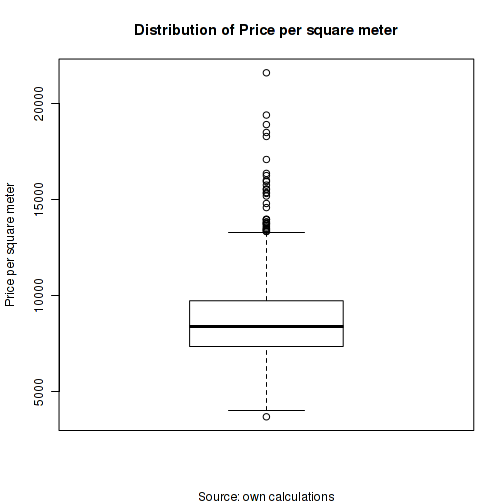 

```r

### w czasie
ggplot(data=dane,aes(x=dataDod,
                     y=CenaM2,
          group=format(dataDod,'%Y-%m'))) +
  geom_boxplot()
```

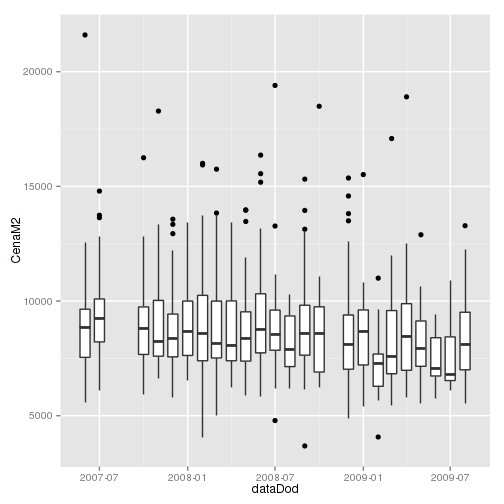 

```r


p<-ggplot(data=dane,
       aes(x=dataDod,y=CenaM2,
           group=format(dataDod,'%Y-%m'))) +
  geom_boxplot(outlier.colour='red')+ 
  
  xlab('Add date') + ylab('Price per square meter') +
  ggtitle('Distribution of price per m2 over time')

p 
```

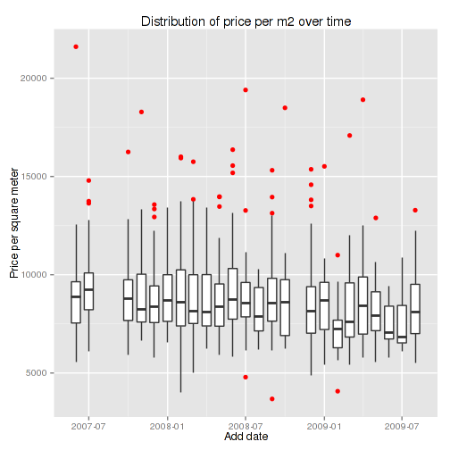 

```r

p + geom_smooth(method = "loess", 
                se=TRUE, 
                colour='red',
                aes(group=1))
```

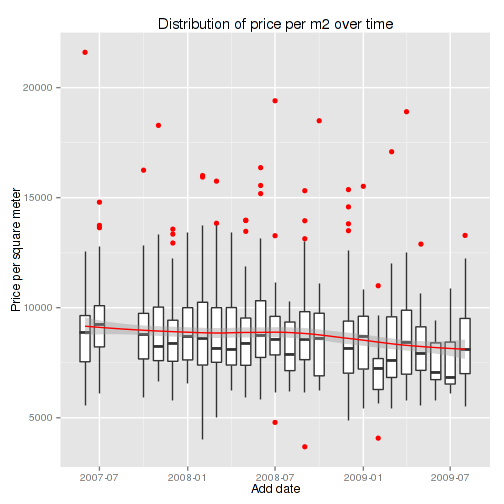 

```r

p + geom_smooth(method = "lm", 
                se=TRUE, 
                colour='red',
                aes(group=1))
```

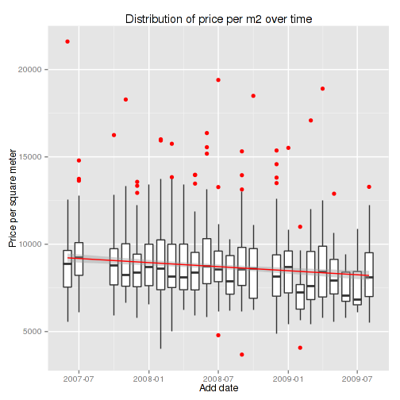 

```r


### zależność cena vs powierzchnia
p<-ggplot(data=dane,aes(x=pow,y=CenaM2)) + 
  geom_point() + xlab('Surface of flat') + ylab('Price per square meter') +
  ggtitle('Relation of surface and price per square meter')

p
```

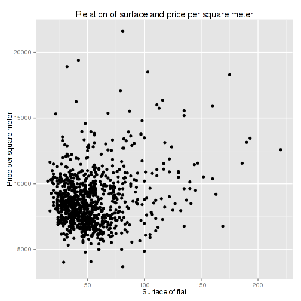 

```r

p + geom_smooth(method='lm',aes(colour='red')) +
  geom_smooth(method='loess',aes(colour='blue')) +
  scale_colour_manual(name="Oszacowania", 
                breaks=c('red','blue'),
                labels=c('LM','LOESS'),
                values=c('red','blue'))
```

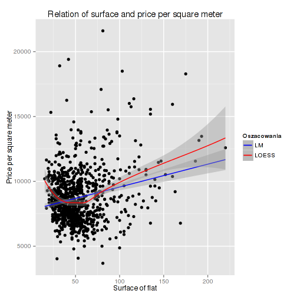 


Data is really messy, outliers cause:
* nonlogical relation between surface and price per square meter (should be descending)
* influence on regression estimation 

Univariate outlier detections
-----------------

Let's start with simple outlier detection - one dimension outlier detection. For this we will use package outliers and extremevalues.

**extremevalues** packages contains function based on comparing to given distribution. There are two methods:

* Method I detects outliers by checking which are below (above) the limit where according to the model distribution less then rho[1] (rho[2]) observations are expected (given length(y) observations)
* Method II detects outliers by finding the observations (not used in the fit) who's fit residuals are below (above) the estimated confidence limit alpha[1] (alpha[2]) while all lower (higher) observations are outliers too.

To sum up - first method is based on the original values, second on residuals from distribution.

Now let see if any of variables has lognormal distribution


```r
library(extremevalues)
par(mfrow=c(2,2))
plot(density(log(dane$pow)),main='log(Surface)')
plot(density(log(dane$CenaM2)),main='log(Price m2)')
plot(density(log(dane$CenaTransakcyjna)),main='log(Price)')
par(mfrow=c(1,1))
```

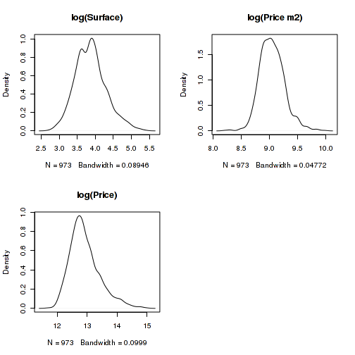 


Density plots indicates that we deal with lognormal distributions.
Now, let use function getOutliers


```r
method1<-getOutliers(dane$CenaM2,
                     method='I',
                     distribution="lognormal")

method2<-getOutliers(dane$CenaM2,
                     method='II',
                     distribution="lognormal")

par(mfrow=c(1,2))
outlierPlot(dane$CenaM2,method1,mode="qq")
outlierPlot(dane$CenaM2,method2,mode="residual")
```

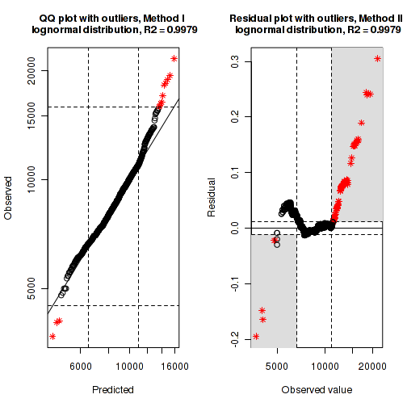 

```r
par(mfrow=c(1,1))
```


In package *outliers* you can find statistical tests for outliers, but we will not discuss it.

* chisq.out.test
* cochran.test
* dixon.test
* grubbs.test

Multivariate distribution
--------------

First we use package **mvoutlier** and functions listed below:

* aq.plot - adjusted quantile plot
* chisq.plot -  chi-square plot
* corr.plot - robust bivariare correlation
* dd.plot - distance-distance plot


Use of adjusted quantile plot.


```r
wyn<-aq.plot(dane[,c('CenaM2','pow')])
```

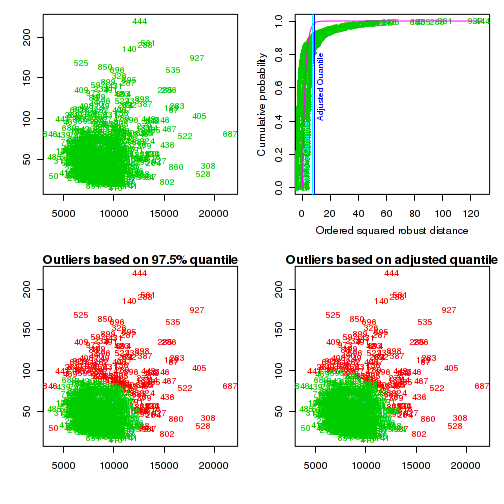 

```r
str(wyn)
```

```
List of 1
 $ outliers: logi [1:973] FALSE FALSE FALSE FALSE FALSE FALSE ...
```


Correlation plots.


res<-corr.plot(dane$pow,dane$CenaM2)


```r
par(mfrow=c(1,2))
wyn<-corr.plot(dane$CenaM2,dane$pow)
wyn<-corr.plot(dane$CenaTransakcyjna,dane$pow)
```

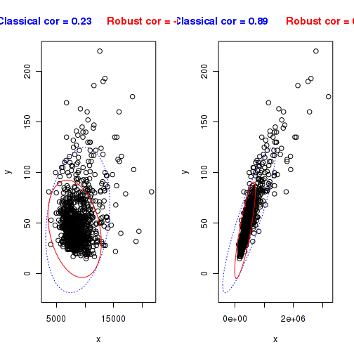 

```r
par(mfrow=c(1,1))
```


The function dd.plot plots the classical mahalanobis distance of the data against the robust mahalanobis distance based on the mcd estimator.


```r
wyn<-dd.plot(dane[,c('CenaM2','pow')])
```

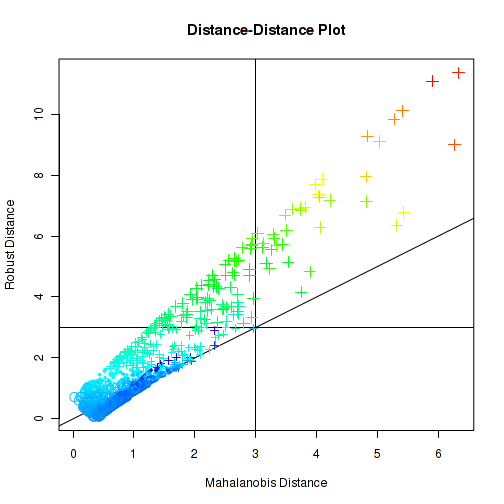 


The function symbol.plot plots the (two-dimensional) data using different symbols according to the robust mahalanobis distance based on the mcd estimator with adjustment.


```r
wyn<-symbol.plot(dane[,c('CenaM2','pow')])
```

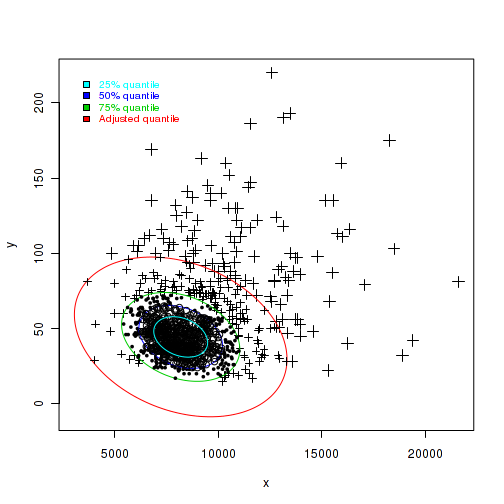 


Multivariate outliers based on regression measures
-------------

For this purpose we will use stats and car packages.

We will build a simple model price - surface


```r
fit<-lm(log(CenaTransakcyjna)~pow,data=dane)
summary(fit)
```

```

Call:
lm(formula = log(CenaTransakcyjna) ~ pow, data = dane)

Residuals:
    Min      1Q  Median      3Q     Max 
-0.9465 -0.1455 -0.0251  0.1536  0.9749 

Coefficients:
            Estimate Std. Error t value Pr(>|t|)    
(Intercept) 1.20e+01   1.65e-02   729.8   <2e-16 ***
pow         1.70e-02   2.78e-04    61.3   <2e-16 ***
---
Signif. codes:  0 '***' 0.001 '**' 0.01 '*' 0.05 '.' 0.1 ' ' 1

Residual standard error: 0.229 on 971 degrees of freedom
Multiple R-squared:  0.794,	Adjusted R-squared:  0.794 
F-statistic: 3.75e+03 on 1 and 971 DF,  p-value: <2e-16
```


Function returns:

**Leverage** given by
$$ h_i = \frac{1}{n} + \frac{(X_i - \overline{X})}{\sum(X_i - \overline{X})^2} $$

** Studentized residuals** given by
$$e_{i}^{*}=\frac{e_i}{S_{e(-1)}\sqrt{1-h_i}}$$

where:
$e_i$ - residual, $S_{e(-1)}$ - standard error of the regression without i-th observation. Studentized residuals follow t-distribution with $n-k-2$ degress of freedom.

**Cook distance**
$$ D_i=\frac{e_i}{k+1}\frac{h_i}{1-h_i}$$
where
k  -- number of dependent variables, $h_i = \frac{1}{n} + \frac{(X_i - \overline{X})}{\sum(X_i - \overline{X})^2}$ , $MSE=\frac{1}{n}\sum_{i=1}^n(\hat{Y}_i-Y_i)^2$
outliers meet:
$$ D_i>\frac{4}{n-k-1} $$

**DFBETA** measures change in estimates of regression parameters when we remove one observation

$$ DFBETA_i=(\sum_{i \in s} \mathbf{x}_i\mathbf{x}_i^T)^{-1}\mathbf{x}_i\frac{e_i}{1-\mathbf{x}_i^T(\sum_{i \in s} \mathbf{x}_i\mathbf{x}_i^T)^{-1}\mathbf{x}_i} $$

**DFBETAS** - standarised version of DFBETA. Measures influence in units of standard error   of regression.

$$ DFBETAS_i=\frac{\hat{\mathbf{\beta}}-\hat{\mathbf{\beta}}_{(-i)}}{\sqrt{MSE_{(-i)}}}=\frac{DFBETA_i}{\sqrt{MSE_{(-i)}}} $$

Outliers meet:

$$ |DFBETAS_i|>2 $$ - small samples
$$ DFBETAS_i>\frac{2}{\sqrt{n}} $$

**DFFITS** -- measures global difference between model with and without *i* observation.

$$ DFFITS_i=\frac{e_i\sqrt{\frac{h_i}{1-h_i}}}{\sqrt{MSE_{(-i)}}\sqrt{{1-h_i}}} \$$

Outliers meet $ |DFFITS_i| > 2\sqrt{\frac{p+1}{n-k-1}} $

**CovRatio** -- measures influence on variance of regression coefficients

$$ COVRATIO_i=\frac{1}{(\frac{n-k-2+t_i^2}{n-k-1})^{k+2}}\frac{1}{(1-h_i)} $$

where $$ h_i $$ is the same as in Cook's distance.
$$ t_i $$ is defined $$ t_i=\frac{e_i}{\sqrt{MSE_{(-i)}}\sqrt{{1-h_i}}} $$

Interpretation:

$$ COVRATIO_i < 1 $$ - elimination of *i* th unit/observation will reduce standard errors of regression coefficients
$$ COVRATIO_i > 1 $$ - elimination of *i* th unit/observation will increase standard errors of regression coefficients

it is suggested to use sample size dependent thresholds 

$$ |COVRATIO_i-1| > 3(k+1)/n  $$


```r
infMea<-influence.measures(fit)
infMea.df<-as.data.frame(infMea$infmat)
infMea.df$ID<-1:nrow(infMea.df)
infMeaLong<-melt(infMea.df,id.vars='ID')
ggplot(data=infMeaLong,aes(x=ID,y=value)) + 
  geom_point() +
  geom_line() +
  facet_wrap(~variable,ncol=1)
```

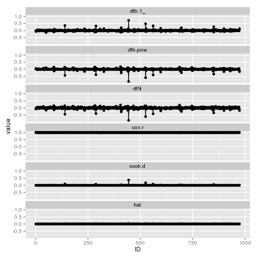 

```r

### findout potential outliers and plot them
dane$Outlier<-as.factor(as.numeric(rowSums(infMea$is.inf)>0))

p<-ggplot(data=dane,aes(x=pow,y=CenaTransakcyjna,color=Outlier)) +
  geom_point()

p + geom_smooth(method='lm',se=F,size=1,aes(color=Outlier))
```

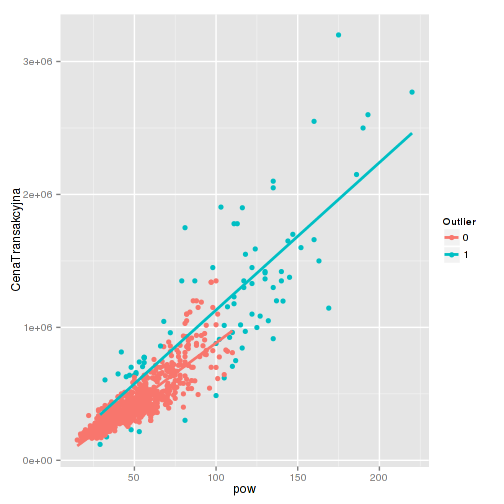 

```r

ggplot(data=dane,aes(x=pow,y=CenaM2,color=Outlier)) +
  geom_point()
```

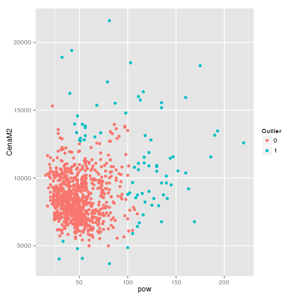 

```r

```


Compare results with and without outliers


```r
fit1<-lm(log(CenaTransakcyjna)~pow,data=dane)
fit2<-lm(log(CenaTransakcyjna)~pow,data=subset(dane,Outlier==0))
summary(fit1)
```

```

Call:
lm(formula = log(CenaTransakcyjna) ~ pow, data = dane)

Residuals:
    Min      1Q  Median      3Q     Max 
-0.9465 -0.1455 -0.0251  0.1536  0.9749 

Coefficients:
            Estimate Std. Error t value Pr(>|t|)    
(Intercept) 1.20e+01   1.65e-02   729.8   <2e-16 ***
pow         1.70e-02   2.78e-04    61.3   <2e-16 ***
---
Signif. codes:  0 '***' 0.001 '**' 0.01 '*' 0.05 '.' 0.1 ' ' 1

Residual standard error: 0.229 on 971 degrees of freedom
Multiple R-squared:  0.794,	Adjusted R-squared:  0.794 
F-statistic: 3.75e+03 on 1 and 971 DF,  p-value: <2e-16
```

```r
summary(fit2)
```

```

Call:
lm(formula = log(CenaTransakcyjna) ~ pow, data = subset(dane, 
    Outlier == 0))

Residuals:
    Min      1Q  Median      3Q     Max 
-0.5972 -0.1281 -0.0133  0.1390  0.4710 

Coefficients:
            Estimate Std. Error t value Pr(>|t|)    
(Intercept) 1.19e+01   1.78e-02   668.0   <2e-16 ***
pow         2.00e-02   3.45e-04    57.9   <2e-16 ***
---
Signif. codes:  0 '***' 0.001 '**' 0.01 '*' 0.05 '.' 0.1 ' ' 1

Residual standard error: 0.185 on 891 degrees of freedom
Multiple R-squared:  0.79,	Adjusted R-squared:  0.789 
F-statistic: 3.35e+03 on 1 and 891 DF,  p-value: <2e-16
```

```r
par(mfrow=c(2,2))
plot(fit1)
```

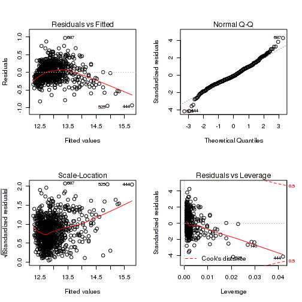 

```r
plot(fit2)
```

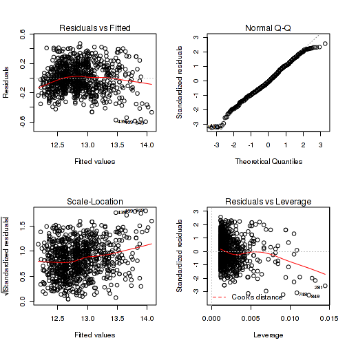 

```r
par(mfrow=c(1,1))
```


If we do not want to detect outliers in our dataset we could use robust methods such as quantile regression to depend on median instead of mean or robust methods.

Let consider robust linear regression which could be used with MASS::rlm function.

Source: http://cran.r-project.org/doc/contrib/Fox-Companion/appendix-robust-regression.pdf

Linear least-squares estimates can behave badly when the error distribution is not normal, particularly when the errors are heavy-tailed. One remedy is to remove influential observations from the least-squares fit.

Another approach, termed robust regression,is to employ a fitting criterion that is not as vulnerable as least squares to unusual data. The most common general method of robust regressionis M-estimation, introduced by Huber (1964). Consider the linear model:

$$y_i=\alpha+\beta_i x_{i1}+\beta_2 x_{i2}+ \ldots + \beta_k x_{ik} + \epsilon_i=\mathbf{x^'_i\beta}+\epsilon_i$$

for the ith of n observations. The fitted model is:

$$y_i=a + b_1x_{i1} + b_2 x_{i2} + \ldots + b_k x_{ik} + e_i=\mathbf{x^'_ib}+e_i$$

The general M-estimator minimizes the objective function 

$$\sum_{i=1}^{n}\rho(e_i)=\sum_{i=1}^{n}\rho(y_i-\mathbf{x^'_ib})$$

where the function $\rho$ gives the contribution of each residual to the objective function. Areasonable $\rho$ should have the following properties:

* $\rho(e) \geq 0$
* $\rho(0)=0$
* $\rho(e)=\rho(-e)$
* $\rho(e_i) \geq \rho(e_{i'})$ for $|e_i| > |e_{i'}|$

For example, for least-square regression, $\rho(e)=e_{i}^2$

Let $\psi=\rho'$ be the derivate of $\rho$. Differentiating the objective function with respect to the coefficients $\mathbf{b}$ and setting partial derivates to 0, produces a system of $k+1$ estimating equations for the coefficients:

$$\sum_{i=1}^{n}\psi(y_i-\mathbf{x^'_ib})\mathbf{x^'_i}=\mathbf{0}$$

Define the weight function $w(e)=\psi(e)/e$ and let $w_i=w(e_i)$. Then the estimating equations may be written as

$$\sum_{i=1}^{n}w_i(y_i-\mathbf{x^'_ib})\mathbf{x^'_i}=\mathbf{0})$$

Solving the estimating equations is a weighted least-squares problem, minimizing $\sum w_i^2e_i^2$. The  weights, however, depend upon the residuals, the residuals depend upon the estimated coefficients, and the estimated coefficients depend upon the weight.


```r
fit1<-lm(CenaM2~pow,data=dane)
fit2<-rlm(CenaM2~pow,data=dane)
summary(fit1)
```

```

Call:
lm(formula = CenaM2 ~ pow, data = dane)

Residuals:
   Min     1Q Median     3Q    Max 
 -5546  -1363   -202    970  12376 

Coefficients:
            Estimate Std. Error t value Pr(>|t|)    
(Intercept)  7802.87     144.31   54.07  < 2e-16 ***
pow            17.61       2.43    7.24  9.3e-13 ***
---
Signif. codes:  0 '***' 0.001 '**' 0.01 '*' 0.05 '.' 0.1 ' ' 1

Residual standard error: 2010 on 971 degrees of freedom
Multiple R-squared:  0.0512,	Adjusted R-squared:  0.0502 
F-statistic: 52.4 on 1 and 971 DF,  p-value: 9.29e-13
```

```r
summary(fit2)
```

```

Call: rlm(formula = CenaM2 ~ pow, data = dane)
Residuals:
   Min     1Q Median     3Q    Max 
 -5262  -1214    -75   1127  12660 

Coefficients:
            Value    Std. Error t value 
(Intercept) 7868.837  125.970     62.466
pow           13.286    2.124      6.256

Residual standard error: 1770 on 971 degrees of freedom
```


Comparison of methods


```r
fit2a<-rlm(CenaM2~pow,data=dane,method='M')
fit2b<-rlm(CenaM2~pow,data=dane,method='M',psi=psi.huber)
fit2c<-rlm(CenaM2~pow,data=dane,method='M',psi=psi.hampel)
fit2d<-rlm(CenaM2~pow,data=dane,method='M',psi=psi.bisquare)
coefficients(fit2a)
```

```
(Intercept)         pow 
    7868.84       13.29 
```

```r
coefficients(fit2b)
```

```
(Intercept)         pow 
    7868.84       13.29 
```

```r
coefficients(fit2c)
```

```
(Intercept)         pow 
    7877.49       14.12 
```

```r
coefficients(fit2d)
```

```
(Intercept)         pow 
    7937.29       11.07 
```


Compare visually


```r
plot(x=dane$pow,y=dane$CenaM2)
abline(coef=coefficients(fit2a),col='red')
abline(coef=coefficients(fit2b),col='blue')
abline(coef=coefficients(fit2c),col='green')
abline(coef=coefficients(fit2d),col='black')
```

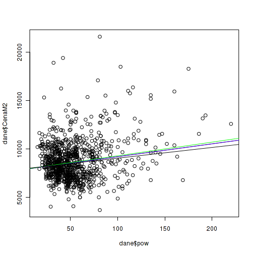 


Add weights to dane data.frame and use colour to detect outliers.


```r
dane$Weights<-fit2a$w
ggplot(data=dane,aes(x=pow,y=CenaM2,colour=Weights)) + geom_point()
```

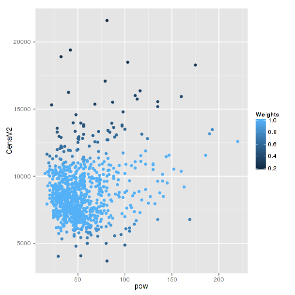 


Now let compare two methods - least-square and robust least-square.


```r
fit1<-lm(CenaTransakcyjna~pow,data=dane)
fit2<-rlm(CenaTransakcyjna~pow,data=dane)
lmcoeff<-as.numeric(coefficients(fit1))
rlmcoeff<-as.numeric(coefficients(fit2))

ggplot(data=dane,aes(x=pow,y=CenaTransakcyjna)) +
  geom_point() + 
  geom_abline(aes(intercept=lmcoeff[1],
                  slope=lmcoeff[2],
                  colour='red')) +
   geom_abline(aes(intercept=rlmcoeff[1],
                  slope=rlmcoeff[2],
                  colour='blue')) +
   scale_colour_manual(name="Oszacowania", 
                      breaks=c('red','blue'),
                      labels=c('LM','RLM'),
                      values=c('red','blue'))
```

 


The same for Price per square meter


```r
fit1<-lm(CenaM2~pow,data=dane)
fit2<-rlm(CenaM2~pow,data=dane)
summary(fit1)
```

```

Call:
lm(formula = CenaM2 ~ pow, data = dane)

Residuals:
   Min     1Q Median     3Q    Max 
 -5546  -1363   -202    970  12376 

Coefficients:
            Estimate Std. Error t value Pr(>|t|)    
(Intercept)  7802.87     144.31   54.07  < 2e-16 ***
pow            17.61       2.43    7.24  9.3e-13 ***
---
Signif. codes:  0 '***' 0.001 '**' 0.01 '*' 0.05 '.' 0.1 ' ' 1

Residual standard error: 2010 on 971 degrees of freedom
Multiple R-squared:  0.0512,	Adjusted R-squared:  0.0502 
F-statistic: 52.4 on 1 and 971 DF,  p-value: 9.29e-13
```

```r
summary(fit2)
```

```

Call: rlm(formula = CenaM2 ~ pow, data = dane)
Residuals:
   Min     1Q Median     3Q    Max 
 -5262  -1214    -75   1127  12660 

Coefficients:
            Value    Std. Error t value 
(Intercept) 7868.837  125.970     62.466
pow           13.286    2.124      6.256

Residual standard error: 1770 on 971 degrees of freedom
```

```r

lmcoeff<-as.numeric(coefficients(fit1))
rlmcoeff<-as.numeric(coefficients(fit2))

ggplot(data=dane,aes(x=pow,y=CenaM2)) +
  geom_point() + 
  geom_abline(aes(intercept=lmcoeff[1],
                  slope=lmcoeff[2],
                  colour='red')) +
   geom_abline(aes(intercept=rlmcoeff[1],
                  slope=rlmcoeff[2],
                  colour='blue')) +
   scale_colour_manual(name="Oszacowania", 
                      breaks=c('red','blue'),
                      labels=c('LM','RLM'),
                      values=c('red','blue'))
```

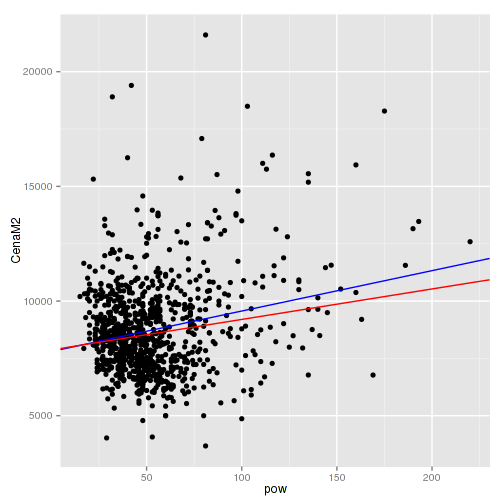 

