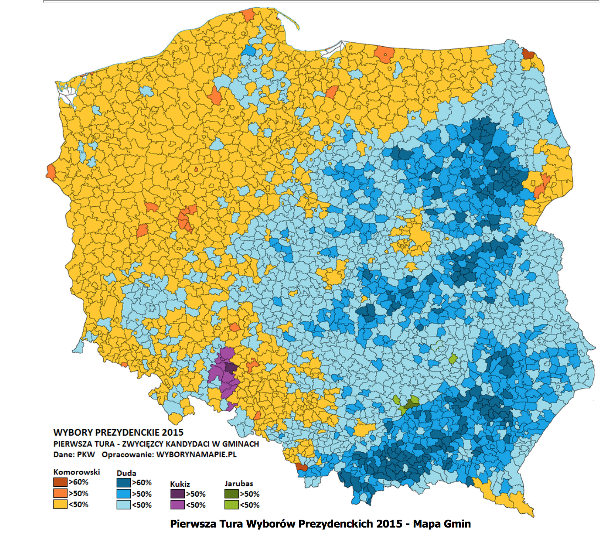
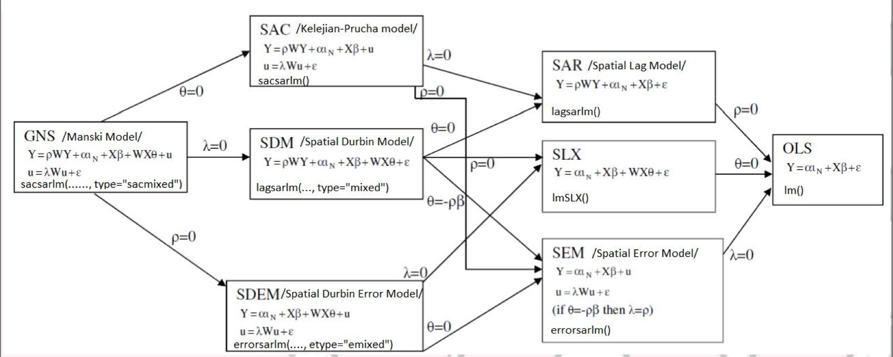
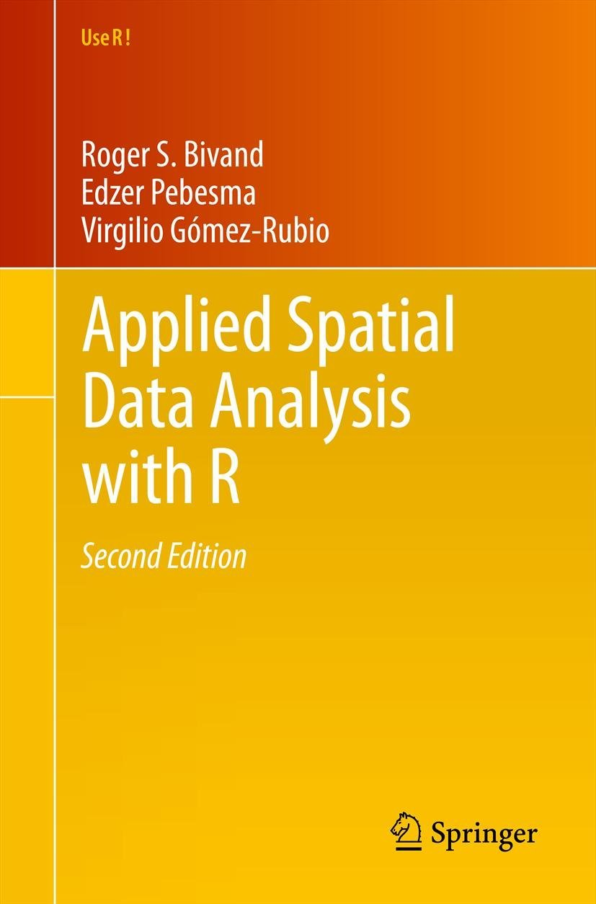
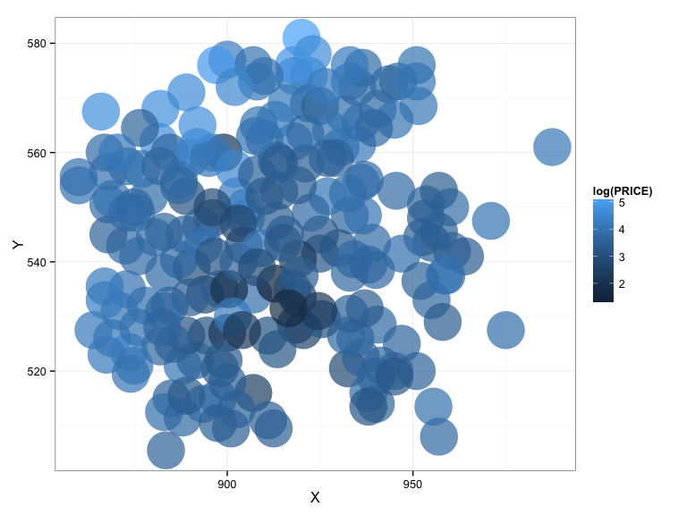
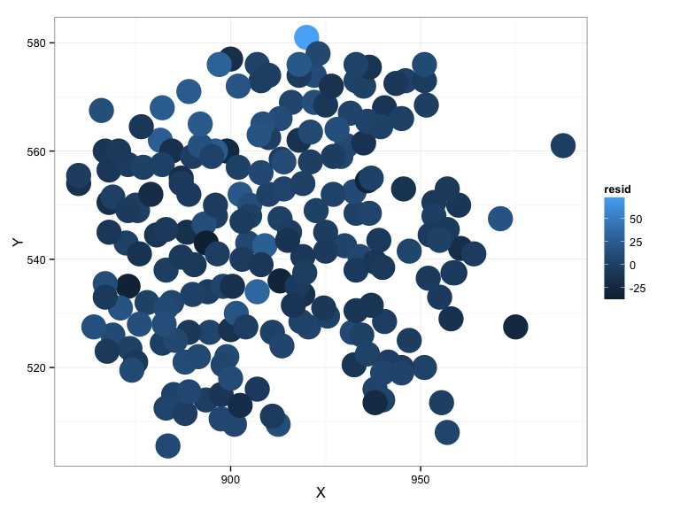
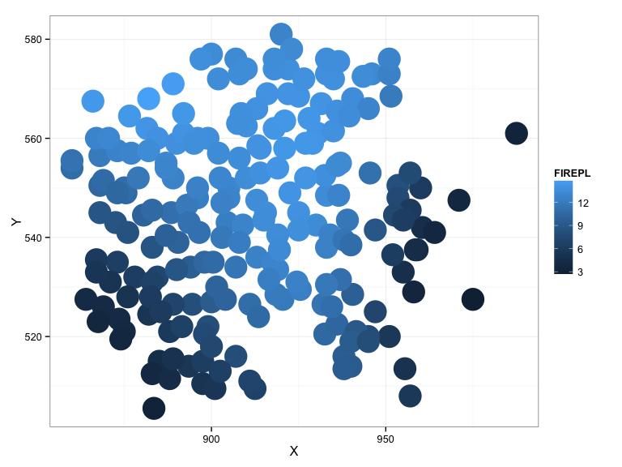
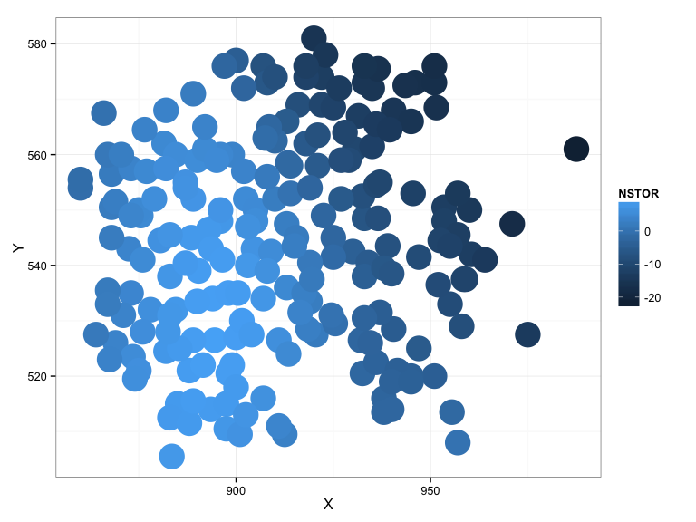

# Spatial Models in R
Maciej Beręsewicz  
15 May 2015  


## Agenda

1. Spatial models
2. Geographically weighted regression (GWR)
3. Interpretation of parameters
4. GWR in R
5. References


## Spatial analysis

Waldo Tobler (1970)

> Everything is related to everything else, but near things are more related than distant things.

1. Polygon/Area data analysis -- requires information about membership in area (eg. voievodships, provinces)
2. Point data analysis -- requires information about location of each point

## Spatial Correlation


## Spatial Correlation




## Basic spatial models 

* Spatial Autocorrelation Model (SAR Lag)
* Spatial Error Model (SAR Error)
* Spatial Autocorrelation and Error Model (SAR Lag and Error)




## Basic spatial models - literature

Please refer to book Bivand, R. S., Pebesma, E., & Gómez-Rubio, V. (2013). Applied spatial data analysis with R (Vol. 10). Springer Science & Business Media.



## Basic spatial models - literature (in Polish)


## Basic spatial models - literature (in Polish)


## Geographically weighted regression

* Geographically weighted regression (GWR) is an exploratory technique mainly intended to indicate where non-stationarity is taking place on the map, that is where locally weighted regression coefficients move away from their global values.

* Its basis is the concern that the fitted coefficient values of a global model, fitted to all the data, may not represent detailed local variations in the data adequately – in this it follows other local regression implementations.

* **We use it to explore spatial non-stationarity**

## Geographically weighted regression - notation

Consider a global regression model written as:

$$
y_i = \beta_0 + \sum_k \beta_k x_{ik} + \epsilon_i
\label{global}
$$

We can consider the following cases:

a) parameters are constant for all observations (fixed)
b) parameters can be different for each observation (random)

Therefore, we can consider situatio when $\beta_k$ depends on location $(u_i,v_i)$ which can be written as $\beta_k(u_i,v_i)$.

## Geographically weighted regression - notation

In general we can written the model by

$$
\mathbf{Y} = \mathbf{\beta}\mathbf{X} + \mathbf{\epsilon}
$$

and we can estimate  $\mathbf{\beta}$ by standard OLS estimator given by 

$$
\hat{\mathbf{\beta}} = (\mathbf{X}^T\mathbf{X})^{-1}\mathbf{X}^T\mathbf{Y}.
$$

## Geographically weighted regression - notation

The GWR equivalent is 

$$
\mathbf{Y} = (\mathbf{\beta} \otimes \mathbf{X})\mathbf{1} + \mathbf{\epsilon}.
$$

$\mathbf{\beta}$ and $\mathbf{X}$ will have dimensions $n \times (k+1)$ and $\mathbf{1}$ is a $(k + 1) \times 1$ vector of 1. The matrix $\mathbf{\beta}$ now consists of $n$ sets of local parameters and has the following structure

$$
\mathbf{\beta} = 
 \begin{pmatrix}
  \beta_{0}(u_1,v_1) & \beta_{1}(u_1,v_1) & \cdots & \beta_{k}(u_1,v_1) \\
  \beta_{0}(u_2,v_2) & \beta_{1}(u_2,v_2) & \cdots & \beta_{k}(u_2,v_2) \\
  \vdots  & \vdots  & \ddots & \vdots  \\
  \beta_{0}(u_n,v_n) & \beta_{1}(u_n,v_n) & \cdots & \beta_{k}(u_n,v_n)
 \end{pmatrix}
$$

Parameters for each row of the above matrix are estimated by 

$$
\hat{\beta}(i) = (\mathbf{X}^T\mathbf{W}(i)\mathbf{X})^{-1}\mathbf{X}^T\mathbf{W(i)}\mathbf{Y},
$$

Where $\mathbf{W}(i) = diag(\mathbf{w})$ and $\mathbf{w} = (w_{i1},w_{i2}, \ldots, w_{in})^T$. $w_{in}$ is a weight given to data point $n$ in the calibration of the model for $i$

## Geographically weighted regression - local standard errors

We can rewrite estimator for $\mathbf{\beta}$ of GWR model as:

$$
\hat{\mathbf{\beta}}(u_i,v_i) = \mathbf{Cy},
$$

where $\mathbf{C} = (\mathbf{X}^T\mathbf{W}(i)\mathbf{X})^{-1}\mathbf{X}^T\mathbf{W(i)}$. The variance of the parameter estimates is given by 

$$
Var({\hat{\mathbf{\beta}}(u_i,v_i)}) = \mathbf{C}\mathbf{C}^T\sigma^2
$$

where $\sigma^2 = \sum_i (y_i - \hat{y}_i)/ (n-2 \nu_1 + \nu_2)$ where $\nu_1 = tr(\mathbf{S})$, $\nu_1 = tr(\mathbf{S}^T\mathbf{S})$ and $\mathbf{S}$ is a hat matrix which maps $\hat{\mathbf{y}}$ on $\mathbf{y}$ in the following manner:

$$
\hat{\mathbf{y}} = \mathbf{Sy}
$$

where each row of $\mathbf{S}$ is given by

$$
\mathbf{r}_i = \mathbf{X}_i\mathbf{X}^T\mathbf{W}(i)\mathbf{X})^{-1}\mathbf{X}^T\mathbf{W(i)}.
$$
FInally, standard errors are obtained by

$$
SE( \hat{\mathbf{\beta}}_i ) = \sqrt{ Var(\mathbf{\beta}_i) }.
$$

where $\mathbf{\beta}_i$ is a short-hand notation for $\mathbf{\beta}(u_i,v_i)$.


## Geographically weighted regression - weight matrix

We can consider the following settings for weights

* $w_{ij}=1, \forall i, j$

* $w_{ij} = 1$ if $d_{ij} < d$, otherwise $w_{ij}=0$

* $w_{ij} = exp( -0.5 (d_{ij} / b)^2  )$ - Gaussian weighting function

* $w_{ij} = [1 - (d_{ij}/b)^2 ]^2$ if $d_{ij} < d$, otherwise $w_{ij} = 0$ - bi-square function


## Geographically weighted regression - $b$ selection criterion

We can consider the following methods for model selection

* Cross-Validation Criterion (CV)

$$
CV = \sum_{i=1}^n (y_{i} - \hat{y}_i(b))^2
$$

* Generalized Cross-Validation Criterion (GCV)

$$
GCV = n \sum_{i=1}^{n} (y_{i} - \hat{y}_i(b))^2 (n - \nu_1)^2
$$

* the Akaike Information Criterion (AIC)

$$
AIC_c = 2n log (\hat{\sigma}) + n log(2\pi) + n \times \frac{n + tr(\mathbf{S})}{n-2-str(\mathbf{S})}
$$

* Bayesian Information Criterion (BIC)

$$
BIC = -2log(L) + k log(n)
$$

## Geographically weighted regression -- highlights

* GWR allows to take into account spatial heterogenity
* GWR allows to take into account assumption that coefficient vary in space
* GWR will give information about possible

## Visualisation of results


 


## Information about dataset

Topic: House sales price and characteristics for a spatial hedonic regression, Baltimore, MD 1978.
Source : Original data made available by Robin Dubin, Weatherhead School of Management, Case Western Research University, Cleveland, OH, Robin.Dubin@weatherhead.cwru.edu.
Reference: Dubin, Robin A. (1992). Spatial autocorrelation and neighborhood quality. Regional Science and Urban Economics 22(3), 433-452.

## Information about dataset

* STATION	ID variable
* PRICE - sales price of house iin $1,000 (MLS)
* NROOM - number of rooms
* DWELL - 1 if detached unit, 0 otherwise
* NBATH - number of bathrooms
* PATIO - 1 if patio, 0 otherwise
* FIREPL - 1 if fireplace, 0 otherwise
* AC - 1 if air conditioning, 0 otherwise
* BMENT - 1 if basement, 0 otherwise
* NSTOR - number of stories
* GAR - number of car spaces in garage (0 = no garage)
* AGE - age of dwelling in years
* CITCOU - 1 if dwelling is in Baltimore County, 0 otherwise
* LOTSZ - lot size in hundreds of square feet
* SQFT - interior living space in hundreds of square feet
* X - x coordinate on the Maryland grid
* Y - y coordinate on the Maryland grid

## Simple linear regression


```
## 
## Call:
## lm(formula = PRICE ~ DWELL + NBATH + PATIO + FIREPL + AC + BMENT + 
##     NSTOR + GAR + CITCOU + LOTSZ + SQFT, data = baltimore)
## 
## Residuals:
##     Min      1Q  Median      3Q     Max 
## -35.351  -6.600  -0.896   6.124  74.261 
## 
## Coefficients:
##             Estimate Std. Error t value Pr(>|t|)    
## (Intercept)  8.00529    5.50218   1.455 0.147264    
## DWELL        6.36037    2.55389   2.490 0.013576 *  
## NBATH        6.18702    1.83627   3.369 0.000905 ***
## PATIO        9.43528    2.76449   3.413 0.000778 ***
## FIREPL      10.76620    2.44020   4.412 1.68e-05 ***
## AC           8.24456    2.30796   3.572 0.000444 ***
## BMENT        3.81140    1.00446   3.794 0.000196 ***
## NSTOR       -4.27379    2.84687  -1.501 0.134882    
## GAR          5.60412    1.71134   3.275 0.001248 ** 
## CITCOU      12.42270    2.17455   5.713 4.01e-08 ***
## LOTSZ        0.03536    0.01714   2.063 0.040443 *  
## SQFT         0.38175    0.21273   1.795 0.074245 .  
## ---
## Signif. codes:  0 '***' 0.001 '**' 0.01 '*' 0.05 '.' 0.1 ' ' 1
## 
## Residual standard error: 12.6 on 199 degrees of freedom
## Multiple R-squared:   0.73,	Adjusted R-squared:  0.7151 
## F-statistic: 48.92 on 11 and 199 DF,  p-value: < 2.2e-16
```

## Visualisation of residuals

 

## GWR in R


```
## Bandwidth: 56.69026 CV score: 36351.51 
## Bandwidth: 91.63518 CV score: 37637.86 
## Bandwidth: 35.0931 CV score: 34314.3 
## Bandwidth: 21.74533 CV score: 32481.94 
## Bandwidth: 13.49595 CV score: 32949 
## Bandwidth: 20.77383 CV score: 32394.68 
## Bandwidth: 19.02757 CV score: 32288.25 
## Bandwidth: 16.91468 CV score: 32280.53 
## Bandwidth: 17.84809 CV score: 32263.26 
## Bandwidth: 17.87388 CV score: 32263.3 
## Bandwidth: 17.82144 CV score: 32263.24 
## Bandwidth: 17.8171 CV score: 32263.24 
## Bandwidth: 17.8172 CV score: 32263.24 
## Bandwidth: 17.81725 CV score: 32263.24 
## Bandwidth: 17.81716 CV score: 32263.24 
## Bandwidth: 17.8172 CV score: 32263.24
```

## GWR in R


```
## Call:
## gwr(formula = PRICE ~ DWELL + NBATH + PATIO + FIREPL + AC + BMENT + 
##     NSTOR + GAR + CITCOU + LOTSZ + SQFT, data = baltimore, coords = cbind(baltimore$X, 
##     baltimore$Y), bandwidth = col.bw, hatmatrix = TRUE)
## Kernel function: gwr.Gauss 
## Fixed bandwidth: 17.8172 
## Summary of GWR coefficient estimates at data points:
##                    Min.    1st Qu.     Median    3rd Qu.       Max.
## X.Intercept. -13.050000  -9.548000   0.274000  13.950000  37.770000
## DWELL         -8.052000   4.674000   6.793000   8.951000  12.190000
## NBATH          0.667400   5.116000   6.342000   6.946000   9.431000
## PATIO         -5.532000   3.697000   6.452000   9.648000  12.160000
## FIREPL         2.690000   7.705000  11.800000  13.410000  14.830000
## AC             2.880000   5.978000   7.174000   8.942000  13.610000
## BMENT         -0.098190   3.314000   4.060000   5.332000   6.550000
## NSTOR        -22.410000  -7.504000   1.893000   6.142000   9.463000
## GAR           -0.406400   1.710000   3.275000   5.643000  14.350000
## CITCOU         5.435000  10.690000  13.850000  15.100000  18.340000
## LOTSZ         -0.062190   0.006956   0.048210   0.077330   0.098300
## SQFT          -0.303100  -0.120500   0.042610   0.490100   2.588000
##               Global
## X.Intercept.  8.0053
## DWELL         6.3604
## NBATH         6.1870
## PATIO         9.4353
## FIREPL       10.7662
## AC            8.2446
## BMENT         3.8114
## NSTOR        -4.2738
## GAR           5.6041
## CITCOU       12.4227
## LOTSZ         0.0354
## SQFT          0.3818
## Number of data points: 211 
## Effective number of parameters (residual: 2traceS - traceS'S): 63.19148 
## Effective degrees of freedom (residual: 2traceS - traceS'S): 147.8085 
## Sigma (residual: 2traceS - traceS'S): 10.6491 
## Effective number of parameters (model: traceS): 47.53632 
## Effective degrees of freedom (model: traceS): 163.4637 
## Sigma (model: traceS): 10.12633 
## Sigma (ML): 8.912952 
## AICc (GWR p. 61, eq 2.33; p. 96, eq. 4.21): 1648.773 
## AIC (GWR p. 96, eq. 4.22): 1569.456 
## Residual sum of squares: 16761.99 
## Quasi-global R2: 0.8567619
```

## GWR in R

 

## GWR in R

 

## References

1. Anselin, L (1992) Spatial econometrics. Methods and models. Kluwer Academic, Boston
2. Brundson, C, Fotheringham, AS, Charlton, M (1996) Geographically weighted regression: a method for exploring spatial nonstationarity. Geogr. Anal. 28: pp. 281-298
3. Fotheringham, AS, Brundson, C, Charlton, M (2002) Geographically weighted regression. Wiley, West Sussex
4. Salvati, N., Tzavidis, N., Pratesi, M., & Chambers, R. (2012). Small area estimation via M-quantile geographically weighted regression. Test, 21(1), 1-28.
5. Szymanowski, M., & Kryza, M. (2011). ZASTOSOWANIE REGRESJI WAŻONEJ GEOGRAFICZNIE DO INTERPOLACJI PRZESTRZENNEJ MIEJSKIEJ WYSPY CIEPŁA WE WROCŁAWIU. Prace i Studia Geograficzne, 47, 417-423.
5. R Core Team (2015). R: A language and environment for statistical computing. R Foundation for Statistical Computing, Vienna, Austria. URL http://www.R-project.org/.
6. Roger Bivand and Danlin Yu (2014). spgwr: Geographically weighted regression. R package version 0.6-26. http://CRAN.R-project.org/package=spgwr
7. Suchecki, B. (Ed.). (2010). Ekonometria przestrzenna: metody i modele analizy danych przestrzennych. Wydawnictwo CH Beck.
8. Suchecki, B. (Ed.). (2012) Ekonometria przestrzenna II: modele zaawansowane. Wydawnictwo CH Beck, 2012.

