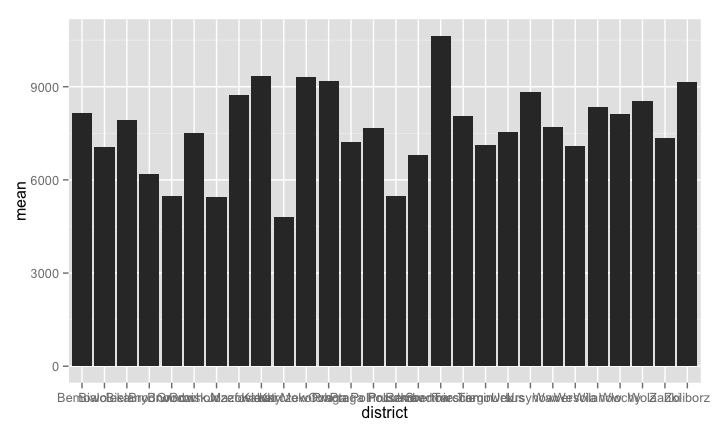
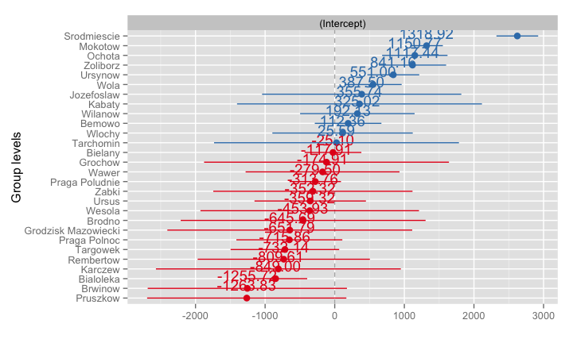

# Mixed models - introduction
Maciej Beręsewicz  
4 May 2015  

## Agenda

1. What are mixed models?
2. Random intercept model
3. Mixed models in R
4. References

## What are mixed models ?

Suppose we have a flat that are located in five districts (A, B, C, D, E) and we think that such location will have influence on the price.

Response: Price of flat

Factor: District

Treatments = Levels of a factor: A, B, C, D, E

Effect: Impact of district on Price of flat

* $\mu$ = flat population mean price
* $\mu_{A}$ = flat population mean price in district A
* effect of A = $\mu_{A} - \mu$

## What are mixed models ? - random and fixed effects

Factor effects are either fixed or random:

* **Fixed**: The levels in the study represent all levels of interest
* **Random**: The levels in the study represent only a sample of the levels of interest.

Mixed models have both fixed and random effects.

In our example, district is fixed since A, B, C, D, E are the only levels of interest.

## What are mixed models ? - random and fixed effects

Fixed effect: Something the experimenter directly manipulates and is often repeatable, e.g., drug administration - one group gets drug, one group gets placebo.

Random effect: Source of random variation / experimental units e.g., individuals drawn (at random) from a population for a clinical trial. Random effects estimates the variability


## What are mixed models ?

* A group of units formed so that units within the group are as homogeneous as possible.
* Reduces the effects of variation among experimental units.
* Treatmets are randomly assigned to blocks.

Lets add to the example: Poznań has 5 districts and 42 supporting units (residential areas, Pol. osiedle). Let assume that we randomly choosen n flats within each of 5 districts but we did not used supporting units to stratification. Therefore, not all supporting units are observed in the sample. 

* fixed - districts
* random - supporting units (residential areas)

## What are mixed models ?

Blocking

Now let assume that we only have four type of flats - 1, 2, 3 and 4+ rooms. Then we sample flats in Poznań, but we do not control for coverage of all of 42 supporting units. Then:

* fixed - room
* random - supporting unit (block) effect

## What are mixed models ?


Mixed models contain both fixed and random effects This has several ramifications:

* Using random effects broadens the scope of inference. That is, inferences can be made on a statistical basis to the population from which the levels of the random factor have been drawn.
* Naturally incorporates dependence in the model. Observations that share the same level of the random effects are being modeled as correlated.
* Using random factors often gives more accurate estimates.
* Sophisticated estimation and fitting methods must be used.


## What are mixed models ?


## What are mixed models ?


## What are mixed models - random intercept model

The basic random intercept model is given by

$$
y_{ij} = \beta + b_i + e_{ij}
$$

where $y_{ij}$ is the dependent variable, $\beta$ is the population mean, $b_i$ is the deviation from the $\beta$ for $i$ level of random error. $e_{ij}$ is a random error.

We assume that

$$
b_i \sim N(0, \sigma^2_b) 
$$

$$
e_{ij} \sim N(0, \sigma^2) 
$$

## What are mixed models - random intercept model

Our assumptions imply that observations on the same random error are correlated, in fact,

$$
cor = \frac{\sigma^2_b}{\sigma^2_b+ \sigma^2}
$$

## What are mixed models ?

There are many varieties of mixed models:

* Linear mixed models (LMM)
* Nonlinear mixed models (NLM)
* Generalized linear mixed models (GLMM)

Today, we will focus only on Linear mixed models

## Mixed models in R

* package lme4 - linear mixed models, function lmer
* package nlme - nonlinear mixed models, function lme

Notation

* (1 | random ) - random intercept
* (x | random ) - random slope
* (1 + x | random ) - random intercept and slope assuming correlation
* (1 | random) + (x-1 | random) - random intercept and slope assuming no correlation
* (1 | random / group ) - hierarchical random intercept model

## Mixed models in R


```r
library(lme4)
library(PBImisc)
library(dplyr)
library(ggplot2)
library(sjPlot)
data("apartments")
apartments <- tbl_df(apartments)
```

## Mixed models in R


```
## Source: local data frame [973 x 16]
## 
##    year month surface     city    district          street n.rooms floor
## 1  2008     1      20 Warszawa Srodmiescie           Bagno       1     7
## 2  2008     1      25 Warszawa    Pruszkow        Pruszkow       1     1
## 3  2008     1      26 Warszawa     Bielany      Marymoncka       1     6
## 4  2008     1      27 Warszawa        Wola          Sienna       1     1
## 5  2008     1      28 Warszawa     Mokotow      Raclawicka       1     1
## 6  2008     1      28 Warszawa     Mokotow      Miaczynska       2     4
## 7  2008     1      30 Warszawa Srodmiescie Pl. Konstytucji       1     1
## 8  2008     1      32 Warszawa     Mokotow        Chelmska       2     3
## 9  2008     1      32 Warszawa Srodmiescie Al.Solidarnosci       1     7
## 10 2008     1      34 Warszawa  Jozefoslaw      Jozefoslaw       1     2
## ..  ...   ...     ...      ...         ...             ...     ...   ...
## Variables not shown: construction.date (int), type (fctr), offer.price
##   (int), transaction.price (int), m2.price (int), condition (fctr), lat
##   (dbl), lon (dbl)
```

## Mixed models in R


```r
mean_prices <- apartments %>%
  group_by(district) %>%
  summarise(mean = mean(m2.price),
            n = n()) %>%
  arrange(desc(mean)) 
```

## Mixed models in R
 

## Mixed models in R


```r
model_first <- lmer(m2.price ~ 1 + (1 | district),
                    data = apartments)
summary(model_first)
```

```
## Linear mixed model fit by REML ['lmerMod']
## Formula: m2.price ~ 1 + (1 | district)
##    Data: apartments
## 
## REML criterion at convergence: 17357.2
## 
## Scaled residuals: 
##     Min      1Q  Median      3Q     Max 
## -2.6978 -0.6328 -0.1385  0.4940  6.2049 
## 
## Random effects:
##  Groups   Name        Variance Std.Dev.
##  district (Intercept) 1081627  1040    
##  Residual             3154473  1776    
## Number of obs: 973, groups:  district, 28
## 
## Fixed effects:
##             Estimate Std. Error t value
## (Intercept)   7961.8      238.2   33.42
```

## Mixed models in R

```
## Linear mixed model fit by REML ['lmerMod']
## Formula: m2.price ~ 1 + (1 | district)
##    Data: apartments
## 
## REML criterion at convergence: 17357.2
## 
## Scaled residuals: 
##     Min      1Q  Median      3Q     Max 
## -2.6978 -0.6328 -0.1385  0.4940  6.2049 
## 
## Random effects:
##  Groups   Name        Variance Std.Dev.
##  district (Intercept) 1081627  1040    
##  Residual             3154473  1776    
## Number of obs: 973, groups:  district, 28
## 
## Fixed effects:
##             Estimate Std. Error t value
## (Intercept)   7961.8      238.2   33.42
```

## Mixed models in R - coefficients


```r
fixef(model_first)
```

```
## (Intercept) 
##    7961.787
```

```r
ranef(model_first)
```

```
## $district
##                     (Intercept)
## Bemowo                192.12623
## Bialoleka            -849.00095
## Bielany               -25.09882
## Brodno               -453.93226
## Brwinow             -1255.72013
## Grochow              -117.91072
## Grodzisk Mazowiecki  -645.68924
## Jozefoslaw            387.50454
## Kabaty                355.73667
## Karczew              -809.61464
## Mokotow              1318.92124
## Ochota               1150.76806
## Praga Polnoc         -651.79297
## Praga Poludnie       -279.49523
## Pruszkow            -1263.83315
## Rembertow            -732.14156
## Srodmiescie          2622.78735
## Tarchomin              25.58784
## Targowek             -715.86100
## Ursus                -352.31822
## Ursynow               841.16286
## Wawer                -174.91316
## Wesola               -359.32169
## Wilanow               325.01978
## Wlochy                112.35876
## Wola                  550.99620
## Zabki                -313.76466
## Zoliborz             1117.43884
```

## Mixed models in R - coefficients plot


```r
sjp.lmer(model_first,sort.coef=TRUE)
```

```
## Plotting random effects...
```

 

## More to go

* random slope
* random slope and intercept
* hierarchical linear model
* within-group heteroscedasticity structure, within-group correlation structure
* spatial heterogenity


## References

1. Jones Galin, Introduction to Mixed Models in R  http://users.stat.umn.edu/~galin/IntroductionToMixedModelsInR.pdf
2. Bates D, Maechler M, Bolker BM and Walker S (2014). “lme4: Linear mixed-effects
models using Eigen and S4.” ArXiv e-print; submitted to _Journal of Statistical
Software_, http://arxiv.org/abs/1406.5823
3. Bates DM, DebRoy S (2004). “Linear mixed models and penalized least squares.” Journal of Multivariate Analysis, 91(1), 1–17. doi:10.1016/j.jmva.2004.04.013.
4. Chambers JM (1993). “Linear Models.” In JM Chambers, TJ Hastie (eds.), Statistical Models in S, chapter 4, pp. 95–144. Chapman & Hall
5. Laird NM, Ware JH (1982). “Random-Effects Models for Longitudinal Data.” Biometrics, 38, 963–974.
6. Pinheiro JC, Bates DM (2000). Mixed-Effects Models in S and S-Plus. Springer. ISBN
0-387-98957-0.
7. Burzykowski, T. (2013). Linear mixed-effects models using R: a step-by-step approach. Springer Science & Business Media.
8. Gelman, A. (2005). Analysis of variance—why it is more important than ever. The Annals of Statistics, 33(1), 1-53.
