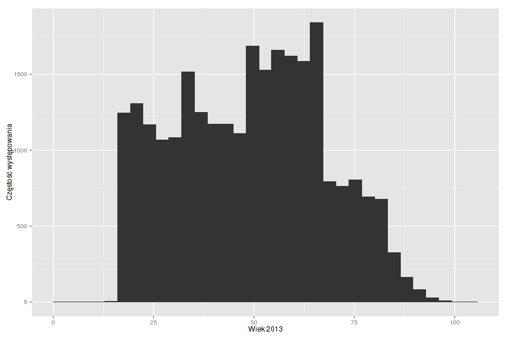
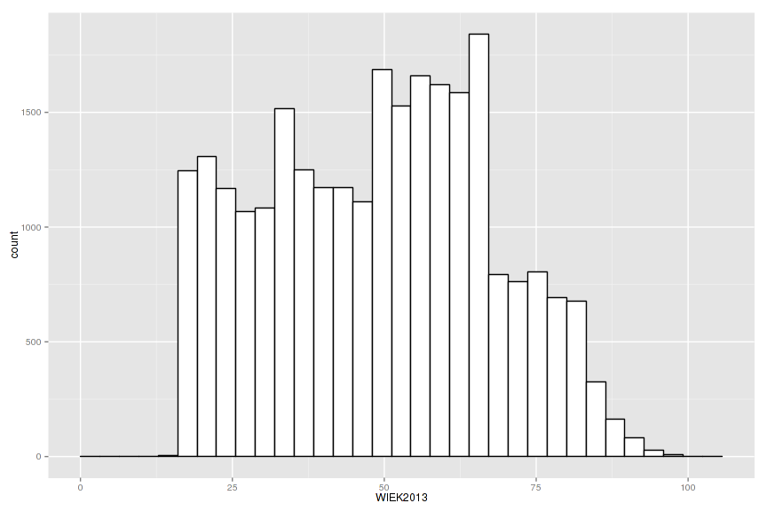
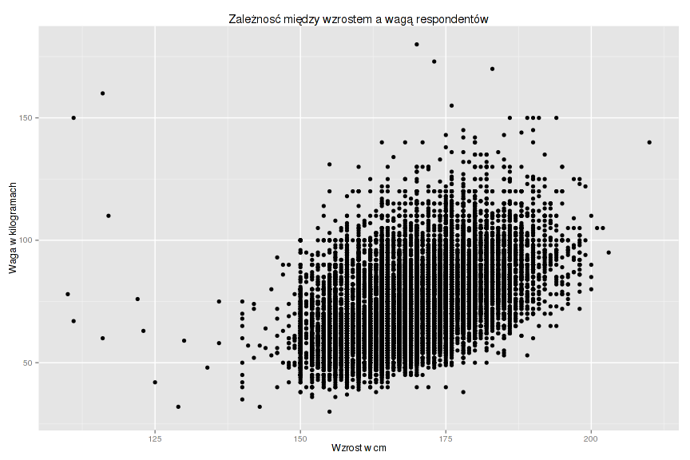
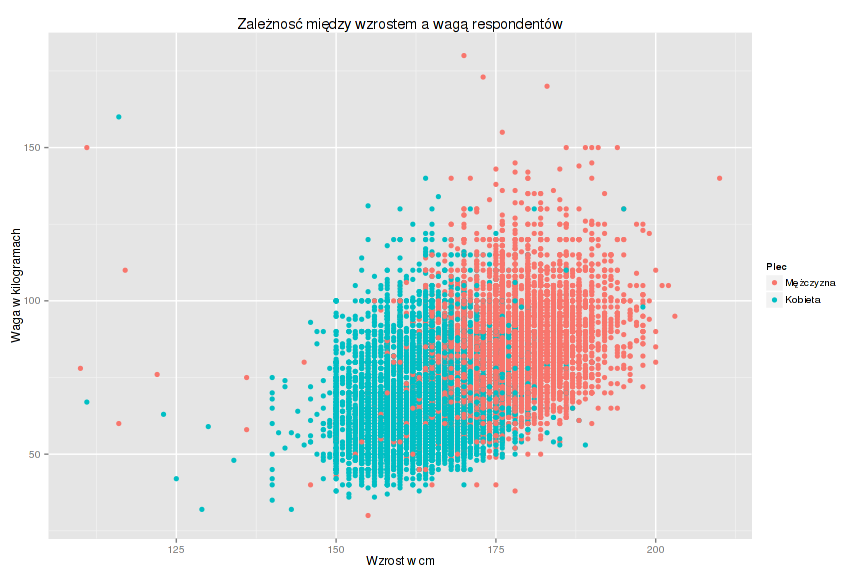
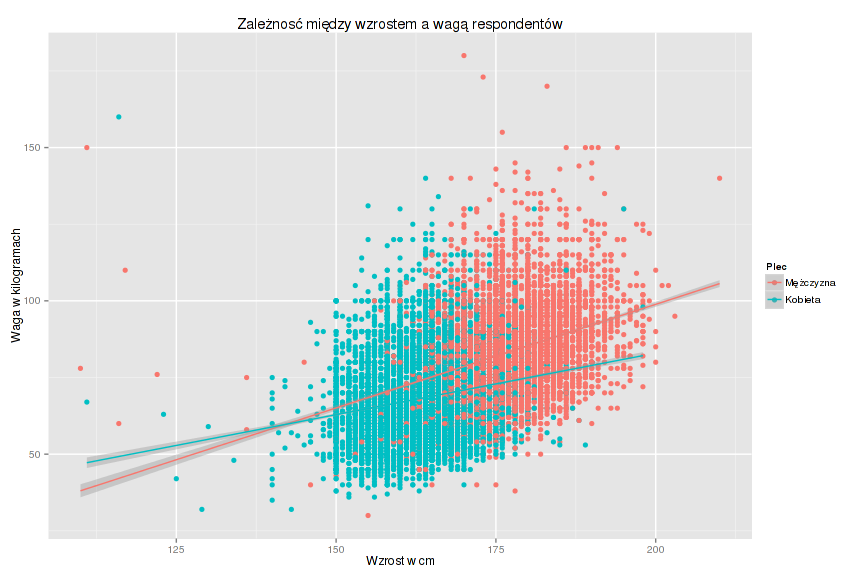
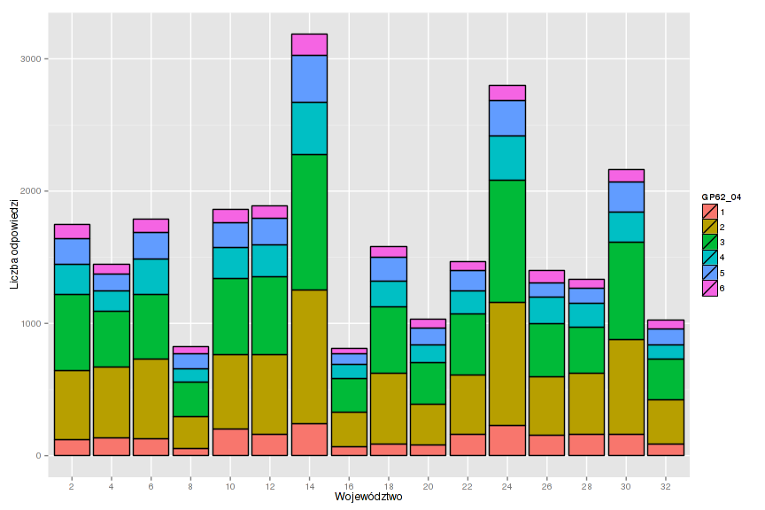
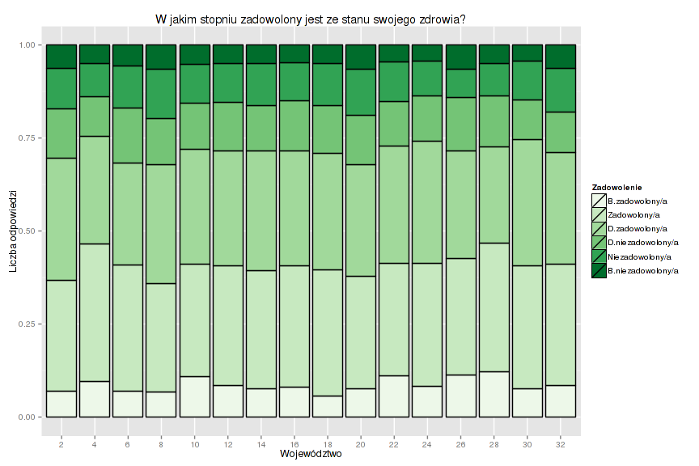
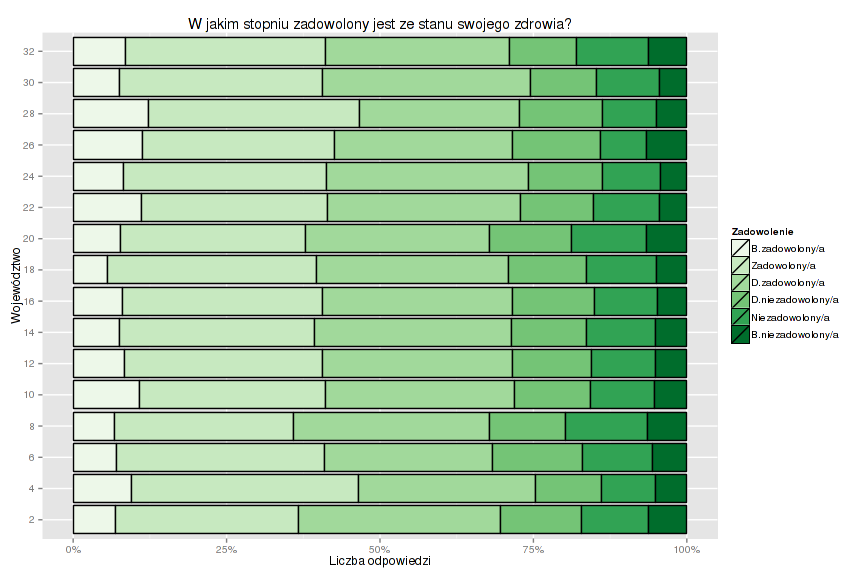
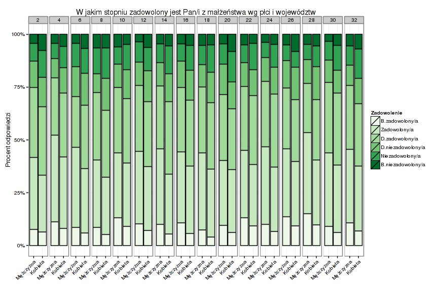
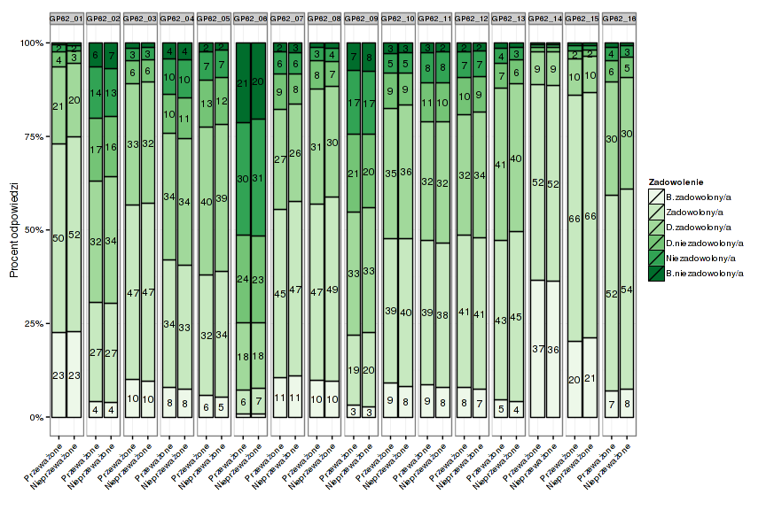

Podstawowe wykresy
----------------

#### Histogram wieku
 

### Histogram wieku - wypełnienie białe, obramowanie czarne

 

### Wykres rozrzutu wzrostu i wagi
 

### Wykres rozrzutu wzrostu i wagi wg płci

 

### Wykres rozrzutu wzrostu i wagi wg wieku (zmienna ciągła)

 

### wykres rozrzutu wzrostu i wagi z dodaniem linii regresji

 

### W jakim stopniu zadowolony jest ze stanu swojego zdrowia wg województw 

 

### W jakim stopniu zadowolony jest ze stanu swojego zdrowia wg województw ale z opisami

 

### Poprzedni wykres ale podany w procentach

 

### Poprzedni wykres ale podany w procentach ze zmianą układu osi oraz etykiet

 

Wykresy bardziej wymagające
-------------

#### W jakim stopniu zadowolony jest z małżeństwa wg płci i województw

 

### Porównanie wszystkich zmiennych dotyczących zadowolenia wg województw
### Dane mają być nieprzeważone i przeważone z wykorzystaniem zmiennej WAGA_2013_IND
### należy również nanieść etykiety na słupki
### wartości poniżej 2 są ukryte

 

