Proste wykresy w analizie danych
========================================================

Materiały na zajęcia poświęcone podstawowym wykresom statystycznym, które wykorzystywane są do poglądowej analizy danych (ang. *exploratory data analysis*, EDA). W ramach zajęć przedstawione i wyjaśnione zostaną następujące wykresy:

* kołowy (ciastkowy) -- ang. *pie chart*
* słupkowy (paskowy) -- ang. *bar plot*
* mozaikowy -- ang. *mosaic plot*
* rozrzutu -- ang. *scatter plot*
* histogram -- ang. *histogram*
* gęstości -- ang. *density plot*
* pudełkowy (ramka wąsy) -- ang. *boxplot*
* skrzypcowy -- ang. *violin plot*

Dodatkowo nauczymy się jak łączyć wykresy za pomocą dwóch funkcji:
* *par*
* *layout*

Przed rozpoczęciem proszę upewnić się, że mają Państwo zainstalowane pakiety.
* *RColorBrewer*
* *vioplot*


Wykres kołowy
--------------
Jednym z podstawowych wykresów do prezentacji danych na skali **nominalnej** jest wykres kołowy. Stosujemy go w przypadku gdy badana zmienna przyjmuje nie dużą liczbę wariantów (np. 4-6). W **R** jest funkcja *pie*, która służy do tworzenia tego typu wykresu. Składnię można znaleźć poniżej.


```r
pie(x, labels = names(x), edges = 200, radius = 0.8,
    clockwise = FALSE, init.angle = if(clockwise) 90 else 0,
    density = NULL, angle = 45, col = NULL, border = NULL,
    lty = NULL, main = NULL, ...)
```


Stworzymy wykres kołowy przedstawiający liczebność reprezentantów w próbie według wielkości miasta. Polecam najpierw utworzyć tabelę, a następnie na jej podstawie stworzyć wykres kołowy. 


```r
KLM<-table(gosp$KLASA_MIEJSCOWOSCI)
pie(KLM)
```

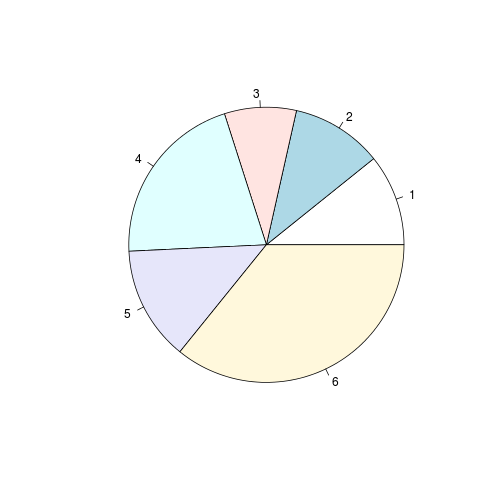 


W przeciwnym wypadku tworzenie wykresu będzie trwało bardzo długo lub w ogóle się nie wykona.

Jeżeli chcemy zmienić wygląd wykresu możemy skorzystać z dodatkowych opcji. Kolory ustawiamy podając wektor wartości w argumencie col. W tym przypadku korzystamy z funkcji brewer.pal z pakietu RColorBrewer (inny zapis: RColorBrewer::brewer.pal).


```r
pie(x=KLM,labels=c('500 tys. i więcej','200-500 tys.', 
                        '100-200 tys.', '20-100 tys.', 'poniżej 20tys.',
                        'wieś'),col=brewer.pal(6,'Blues'))
```

 


Jednak, nie polecamy stosować wykresów kołowych do prezentacji danych.

Wykres słupkowy (paskowy)
--------------

Kolejnym rozpatrywanym typem wykresu jest wykres słupkowy (nazywany również paskowym). Stosujemy go to przedstawiania danych jedno lub dwuwymiarowych na skali nominalnej oraz porządkowej. W **R** znaleźć możemy procedurę *barplot*, która służy do rysowania wykresów słupkowych.

Składnia funkcji jest następująca,


```r
barplot(height, width = 1, space = NULL,
        names.arg = NULL, legend.text = NULL, beside = FALSE,
        horiz = FALSE, density = NULL, angle = 45,
        col = NULL, border = par("fg"),
        main = NULL, sub = NULL, xlab = NULL, ylab = NULL,
        xlim = NULL, ylim = NULL, xpd = TRUE, log = "",
        axes = TRUE, axisnames = TRUE,
        cex.axis = par("cex.axis"), cex.names = par("cex.axis"),
        inside = TRUE, plot = TRUE, axis.lty = 0, offset = 0,
        add = FALSE, args.legend = NULL, ...)
```


Najważniejszym argumentem jest parametr *weight* określającym wysokość słupków. Argument *beside* mówi o tym czy wartości będą przedstawione w postaci słupków stack czy obok sobie. Natomiast *horiz* wskazuje położenie słupków.

Przedstawimy teraz dane dotyczące liczby reprezentantów według województw.


```r
woj<-table(gosp$WOJEWODZTWO)
barplot(woj)
```

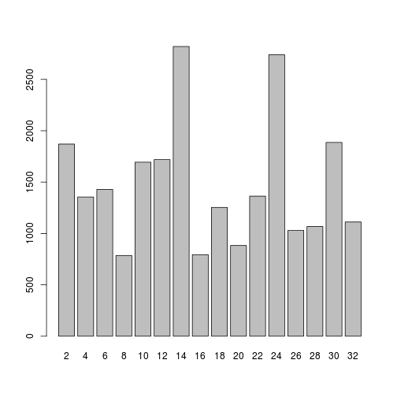 


Zmienimy teraz kilka podstawowych opcji.


```r
### sortujemy wartosci
woj<-sort(woj,decreasing=F)

### tworzymy wykres
barplot(woj,horiz=T,col='red',cex.axis=1,cex.names=.8)
```

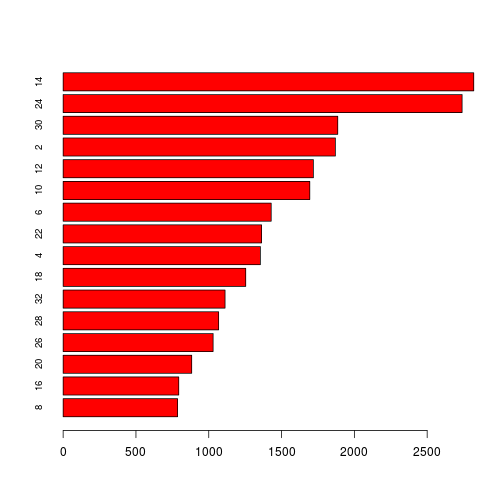 


Aby dodać etykiety należy wykorzystać funkcję text.


```r
### pobieram etykiety
etyk<-etykiety[etykiety$variable=='WOJEWODZTWO',c('values','labels')]
porz<-match(as.numeric(attr(woj,'dimnames')[[1]]),etyk$values) ### łączymy etykiety
etykiety<-etyk[porz,'labels'] ### zapisujemy etykiety do obiektu

### pozycja słupków
pos<-as.numeric(barplot(woj,horiz=T,plot=F)) ### wyciągamy pozycję słupków

### zmiana osi
par(xaxt="s")  ### wyświetlamy tylko jedną oś
barplot(woj,horiz=T,names.arg=F) ### układ horyzontalny
text(y=pos, x=0,  ### dodajemy teksty funkcją tekst
     labels = etykiety, pos = 4, xpd = TRUE)
```

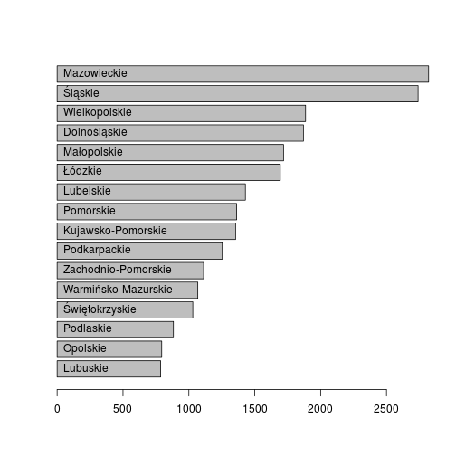 


Wykres słupkowy możemy również wykonać dla tabeli dwuwymiarowej. Takiego typu wykres spotykany jest najczęściej w badaniach marketingowych do przedstawienia odpowiedzi na skalach porządkowych (np. skali Likerta). Dla przykładu zestawmy pytanie GJ2, które dotyczyło liczby książek posiadanych przez gospodarstwo domowe ("Ile jest (w przybliżeniu) w Państwa domu książek"). Respondenci mogli wybrać odpowiedzi z następującej kafeterii (wariantów, po myślniku przedstawione są kody wartości):

* ponad 500 szt. - 6
* 101 - 500 szt. - 5
* 51 - 100 szt. - 4
* 26 - 50 szt. - 3
* do 25 szt. - 2
* nie ma takich zbiorów - 1


```r
### tabela krzyżowa z wykorzystaniem funkcji xtabs
tab<-xtabs(~GJ2+KLASA_MIEJSCOWOSCI,data=gosp)
### wartości sumują się do 100 proc wg klasy miejscowosci
barplot(tab) ### wykres bez procentowania
```

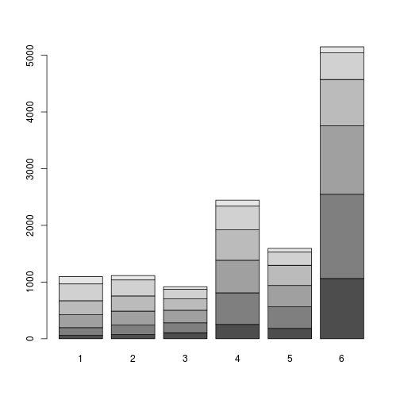 

```r
#### ustalamy procenty wg kolumn
tab<-prop.table(tab,2)*100

barplot(tab,col=brewer.pal(6,'Blues'), ### określenie kolorów 
        names.arg=c('500 tys. i więcej','200-500 tys.', 
                        '100-200 tys.', '20-100 tys.', 'poniżej 20tys.',
                        'wieś'), ### określenie wartości 
        main='Liczba posiadanych książek wg klasy miejscowosci', ### tytuł
        sub='Źródło: opracowanie własne na podstawie Diagnozy Społecznej')stopka
```

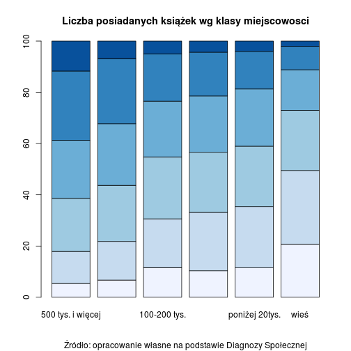 


Możemy dodatkowo nanieść etykiety słupki wykorzystując funkcję tekst. Aby tego dokonać należy jednak wskazać miejsce gdzie mają zostać naniesione etykiety.


```r
## pozycja słupków
labposx<-barplot(tab,plot=FALSE)
labposx<-matrix(rep(labposx,6),nrow=6,ncol=6,byrow=T)
labposy<-apply(tab,2,cumsum)-tab/2
### format procentów
labval<-round(tab,1)
### wykres
barplot(tab,col=brewer.pal(6,'Blues'), ### określenie kolorów 
        names.arg=c('500 tys. i więcej','200-500 tys.', 
                        '100-200 tys.', '20-100 tys.', 'poniżej 20tys.',
                        'wieś'), ### określenie wartości 
        main='Liczba posiadanych książek wg klasy miejscowosci', ### tytuł
        sub='Źródło: opracowanie własne na podstawie Diagnozy Społecznej')stopka
text(x=labposx,y=labposy,labels=labval)
```

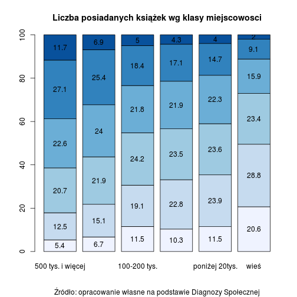 


Na końcu dodamy legendę do wykresu. Służy do tego funkcja legend.


```r
par(mar=rep(6,4), ### zmiana marginesów c(bottom, left, top, right)
    xpd=T) ### umożliwia umieszczanie obiektów na marginesach
barplot(tab,col=brewer.pal(6,'Blues'), ### określenie kolorów 
        names.arg=c('500 tys. i więcej','200-500 tys.', 
                        '100-200 tys.', '20-100 tys.', 'poniżej 20tys.',
                        'wieś'), ### określenie wartości 
        main='Liczba czytanych książek wg klasy miejscowosci (N=12316)', ### tytuł
        sub='Źródło: opracowanie własne na podstawie Diagnozy Społecznej')stopka
text(x=labposx,y=labposy,labels=labval) ### nadanie etykiet
legend(x='right', ### pozycja legendy
       inset=c(-0.27,0), ### pozycja legendy na marginesie 
       legend=c('nie ma takich zbiorów','do 25 szt.',
                '26 - 50 szt.','51 - 100 szt.','101 - 500 szt.',
                'ponad 500 szt.'), ### wyświetlane wartości
       fill=brewer.pal(6,'Blues'), ### kolory poszczególnych słupków
       title='Ile jest (w przyblizeniu) \nw Panstwa domu ksiazek?\n', ### tytuł legendy
       bty='n', ### brak obramowania
       cex=0.7, ### czcionka
       x.intersp=0.5, ### odległość między wartościami legendy (OX)
       y.intersp=0.5, ### odległosć między wartościami legendy (OY)
       title.adj=0.2) ### ustawienie tytułu
```

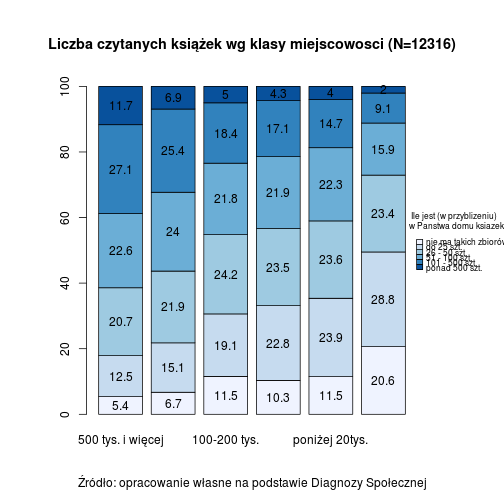 


Wykres mozaikowy
--------------

Kolejnym wykresem jest wykres mozaikowy, który jest wizualizacją tabeli krzyżowej (ang. *cross table*). Wysokość i szerokość przedstawiają dwa wymiary danych (procenty wierszowe i kolumnowe). Możemy go bezpośrednio stosować na obiekcie klasy **xtabs** i **table**. Poniżej znajduje się składnia funkcji mosaic.


```r
mosaicplot(x, main = deparse(substitute(x)),
           sub = NULL, xlab = NULL, ylab = NULL,
           sort = NULL, off = NULL, dir = NULL,
           color = NULL, shade = FALSE, margin = NULL,
           cex.axis = 0.66, las = par("las"), border = NULL,
           type = c("pearson", "deviance", "FT"), ...)
```


Zobaczymy czym różni się wywołanie funkcji **plot** na obiekcie klasy **xtabs**, a później jak zmieni się wykres jeżeli zastosujemy funkcję **mosaicplot** (nie ma różnicy).


```r
### wywołanie przez plot
plot(tab)
```

 

```r
### wywołanie przez mosaicplot
mosaicplot(tab, main='Wykres mozaikowy',
            margin=0, ### określenie marginesów 
           color=brewer.pal(6,'Blues'), ### określenie kolorów
           cex.axis=1,  ### czcionka osi
           border='black', ### obramowanie 
           xlab='Ile jest (w przyblizeniu) w Panstwa domu ksiazek', ### etykieta osi OX
           ylab='Klasa miejscowosci', ### etykieta osi OY
           off=5) ### przetrzeń między elementami mozaiki
```

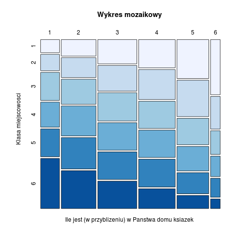 


Oczywiście możemy ten wykres dopracować. Warto go stosować do prezentacji danych tabelarycznych ponieważ od razu możemy zauważyć zależności w tabeli. 

Wykres rozrzutu
--------------

Wykres rozrzutu jest prawdopodobnie najpopularniejszym sposobem przedstawiania danych na skali ilorazowej (ciągłej). Można go stosować do wizualizacji:

* zależności między dwiema zmiennymi,
* detekcji wartości odstających,
* diagnostyka modeli,
* prezentacji zmiany między dwoma badanymi okresami,
* prezentacji wyników analiz wielowymiarowych (np. analiza głównych składowych, analiza korespondencji),
* i wiele wiele innych (np. Marketing Maps )

W podstawowym **R** możemy wykorzystać w tym celu funkcję plot.

Załóżmy, że naszym celem jest porównanie tego jak zmienił się dochód gospodarstw badanych w 2011 i 2013 roku.


```r
gosp1113<-gosp[,c('fdoch_m_osoba_ekw','gdoch_m_osoba_ekw')]
gosp1113<-gosp1113[complete.cases(gosp1113),]

### dane przeważone
plot(x=gosp1113$fdoch_m_osoba_ekw,
     y=gosp1113$gdoch_m_osoba_ekw,
     xlim=c(0,20000), ### określenie tych samych granic dla obydwu osu
     ylim=c(0,20000), 
     xlab='Dochód w 2011 roku', ### etykiety osi
     ylab='Dochód w 2013 roku', 
     main='Porównanie dochodów ekwiwalentych na osobę w gospodarstw domowych
      biorących udział w 2011 i 2013 roku (N=8238)')

#### nanosimy linię referencyjną
abline(a=0, ### wyraz wolny (rozpoczynamy w 0)
       b=1, ### współczynnik kierunkowy
       col='red')
```

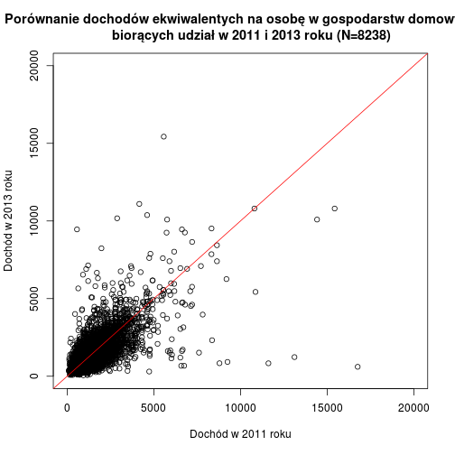 


Możemy również przeprowadzić taką analizę badając więcej niż dwa badania. Poniżej przykład zastosowania funkcji plot do stworzenia wykresu rozrzutu dla 3 i więcej zmiennych. Tym razem dodamy jeszcze okres 2007.


```r
plot(gosp[,c('ddoch_m_00_ekwb','fdoch_m_osoba_ekw','gdoch_m_osoba_ekw')],
     xlim=c(0,20000),ylim=c(0,20000),
     main='Porównanie dochodów ekwiwalentych na osobę w gospodarstw domowych
      biorących udział w 2007, 2011 i 2013 roku',
     labels=c('Rok 2007','Rok 2011','Rok 2013'))
```

 


Aby dodać linię referencyjną trzeba użyć innej, przydatnej funkcji **pairs**.


```r
pairs(gosp[,c('ddoch_m_00_ekwb','fdoch_m_osoba_ekw','gdoch_m_osoba_ekw')],
      panel=function(x,y,...){
        points(x,y)
        abline(a=0,b=1,col='red')
        },xlim=c(0,20000),ylim=c(0,20000),
      labels=c('Rok 2007','Rok 2011','Rok 2013'))
```

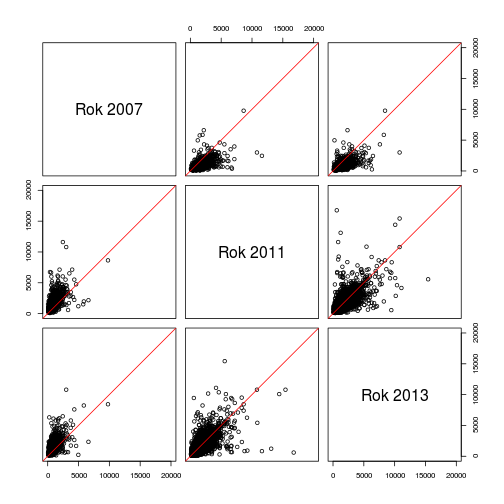 


Histogram
--------------

Podstawowym wykresem do prezentacji rozkładów zmiennych jest histogram. Różni się od wykresu paskowego tym, że poszczególne słupki przylegają do siebie. Wynika to z tego, że zanim histogram jest tworzony dane są dzielone na określoną liczbę przedziałów. Do tworzenia histogramów w  **R**  służy funkcja **hist**, której składnia przedstawiona jest poniżej. 


```r
hist(x, breaks = "Sturges",
     freq = NULL, probability = !freq,
     include.lowest = TRUE, right = TRUE,
     density = NULL, angle = 45, col = NULL, border = NULL,
     main = paste("Histogram of" , xname),
     xlim = range(breaks), ylim = NULL,
     xlab = xname, ylab,
     axes = TRUE, plot = TRUE, labels = FALSE,
     nclass = NULL, warn.unused = TRUE, ...)
```


Histogram może przedstawiać zarówno częstości występowania poszczególnych przedziałów, jak i prawdopodobieństwo wystąpienia (opcja *freq*). *Breaks* określa liczbę tworzonych przedziałów (powinny być tak utworzone aby nie zawierały pustych przedziałów). W **R** są możemy wybrać między trzeba metodami tworzenia przedziałów:

* Struges - wzór: $k+log_2n$
* Scott - wzór: $3.5sn^{-1/3}$
* FD (Freedman i Diaconis (1981)) - wzór: $2Rn^{-1/3}$

gdzie $n$ to wielkość próby, $s$ to odchylenie standardowe, $R$ to rozstęp międzykwartylowy ($Q_3-Q_1$).


Utwórzmy histogram wykorzystując te trzy miary i spójrzmy na różnice


```r
par(mfrow=c(2,2), mar=c(2,2,2,2))
hist(gosp$WAGA_GD_2013,breaks='sturges',xlab='Waga GD 2013',ylab='',main='Sturges')
hist(gosp$WAGA_GD_2013,breaks='scott',xlab='Waga GD 2013',ylab='',main='Scott')
hist(gosp$WAGA_GD_2013,breaks='fd',xlab='Waga GD 2013',ylab='',main='Freedman-Diaconis')
```

 


Proszę zwrócić uwagę, że metoda Scotta oraz Friedmana-Diaconis'a tworzy większą liczbę przedziałów, przez co może wpływać na czytelność danych. Rozkład badanej cechy charakteryzuje się asymetrią prawostronną oznacza to, że w zbiorze danych występują wagi ekstremalne (jak na zachowywanie struktury przez tzw. wagi analityczne).

Histogram stosujemy do prezentacji danych jednowymiarowych.

Wykres gęstości
--------------

W kolejnym podpunkcie omówimy wizualizację pewnej metody statystycznej, którą jest wykres gęstości. Opiera się ona na jądrowej estymacji parametrów rozkładu badanej zmiennej. Co to oznacza? Na podstawie danych estymowane są parametry rozkładu zmiennej tak aby móc przedstawić wykres gęstości. Wykorzystujemy tę miarę w kilku celach:

* wizualnej weryfikacji zgodności z zadanym rozkładem
* wizualizacji zmiany rozkładów badanej cechy w czasie

W **R** najpierw musimy zastosować funkcję **density**, a następnie jej wynik wywołać funkcją plot.


```r
density(x, bw = "nrd0", adjust = 1,
        kernel = c("gaussian", "epanechnikov", "rectangular",
                   "triangular", "biweight",
                   "cosine", "optcosine"),
        weights = NULL, window = kernel, width,
        give.Rkern = FALSE,
        n = 512, from, to, cut = 3, na.rm = FALSE, ...)
```


Wzór na estymator jądrowy opisany jest następującym wzorem:
TODO

Natomiast do wyboru dane są następujące jądra:

a) gausowskie
b) Epanecznikowa
c) kwadratowe
d) trójkątne
e) biweight
f) cosinus
g) optcosine

W pierwszej kolejności przedstawimy rozkład dochodów w 2005 roku i porównamy go z rozkładem normalnym. Chcemy odpowiedzieć na pytanie czy możemy stosować metody oparte na założeniu o normalności w przypadku tych danych.


```r
g2005<-gosp[,c('adoch_os_m_05','WAGA_GD_2005')]
g2005<-g2005[complete.cases(g2005),]

p2005<-density(x=g2005$adoch_os_m_05,
        weights=g2005$WAGA_GD_2005/sum(g2005$WAGA_GD_2005))

plot(p2005,col='red',ylab='Gęstość',xlab='Dochód rozporządzalny',
     main='Porównanie dochodu rozporządzalnego 2005')
lines(x=0:6000,y=dnorm(0:6000,
                       mean(g2005$adoch_os_m_05),
                       sd=sd(g2005$adoch_os_m_05)),col='blue')

legend('topright',fill=c('red','blue'),
       legend=c('estymator jądrowy','rozkład normalny'),bty='n')
```

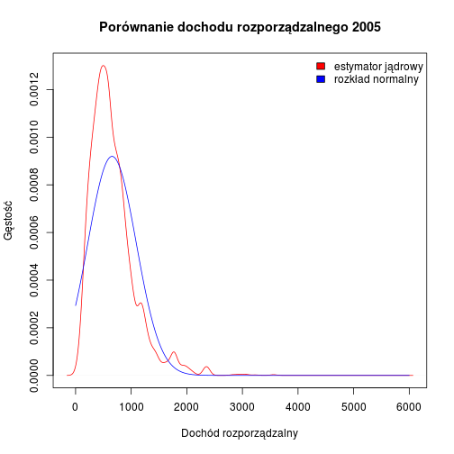 


Naszym celem będzie sprawdzenie jak zmienił się rozkład dochodu rozporządzalnego z ostatniego miesiąca w badaniu z roku 2005 oraz 2013. Pozwoli nam to sprawdzić czy poprawiła się sytuacja gospodarstw domowych na przestrzeni badanego okresu. Aby dokonać poprawnego porównania musimy wybrać odpowiednie zmienne oraz wagi, które są do nich przypisane. Wybieramy następujące zmienne:

* adoch_os_m_05 - dochód rozporządzalny na osobę w 2005 r.
* gdoch_m_osoba_ekw - dochód rozporządzalny na osobę w 2013 r.
* WAGA_GD_2005 - waga gospodarstwa domowego w 2005 r.
* WAGA_GD_2013 - waga gospodarstwa domowego w 2013 r.


```r
g2005<-gosp[,c('adoch_os_m_05','WAGA_GD_2005')]
g2005<-g2005[complete.cases(g2005),]

g2013<-gosp[,c('gdoch_m_osoba_ekw','WAGA_GD_2013')]
g2013<-g2013[complete.cases(g2013),]

p2005<-density(x=g2005$adoch_os_m_05,
        weights=g2005$WAGA_GD_2005/sum(g2005$WAGA_GD_2005))
p2013<-density(x=g2013$gdoch_m_osoba_ekw,
        weights=g2013$WAGA_GD_2013/sum(g2013$WAGA_GD_2013))
plot(p2005,col='red',ylab='Gęstość',xlab='Dochód rozporządzalny',
     main='Porównanie dochodu rozporządzalnego 2005/2013')
lines(p2013,col='blue')
legend('topright',fill=c('red','blue'),legend=c('2005','2013'),bty='n')
```

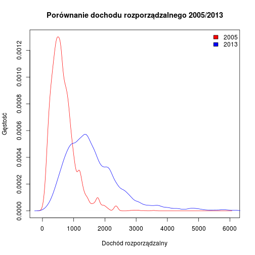 


Możemy zauważyć, że rozkład dochodu zmienił się w porównaniu do 2005 roku. Rozkład przesunął się w prawo, natomiast uległ również spłaszczeniu co może oznaczać o pojawieniu się dużego zróżnicowania w dochodach, większego niż był obserwowalny w 2005 roku. 


Wykres pudełkowy
--------------

Kolejnym wykresem, który służy do przedstawiania rozkładu zmiennej jest wykres pudełkowy (ang. *boxplot*) inaczej ramka wąsy (ang. *box-and-whisker*). W podstawowym **R** służy do tego funkcja **boxplot**. Wykres wykorzystujemy głównie do porównań rozkładów zmiennych wg grup (wstępnej weryfikacji o różnicy średnich/rozkładów) oraz detekcji wartości odstających. W statystyce często wykorzystywany jest do prezentacji wariancji estymatorów oszacowanej np. metodą bootstrap.


```r
boxplot(x, ..., range = 1.5, width = NULL, varwidth = FALSE,
        notch = FALSE, outline = TRUE, names, plot = TRUE,
        border = par("fg"), col = NULL, log = "",
        pars = list(boxwex = 0.8, staplewex = 0.5, outwex = 0.5),
        horizontal = FALSE, add = FALSE, at = NULL)
## lub
boxplot(formula, data = NULL, ..., subset, na.action = NULL)
```


Przedstawmy na wykresie rozrzutu wagę przypisaną gospodarstwom domowym w 2013 roku.


```r
boxplot(gosp$WAGA_GD_2013,
        main='Wykres pudełkowy wagi przypisanej gospodarstwu domowemu w 2013r.',
        sub='Źródło: Opracowanie własne na podstawie badania Diagnoza Społeczna',
        col='gray')
```

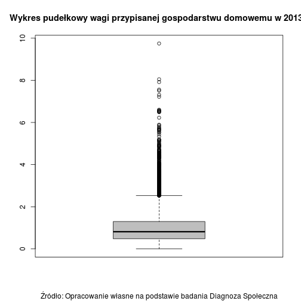 


Następnie przedstawimy tę informację w podziale na grupy wg klasy miejscowości.


```r
boxplot(WAGA_GD_2013~KLASA_MIEJSCOWOSCI,
        notch=TRUE, ### dodajemy przedział ufności dla mediany
        data=gosp)
```

 


Możemy również zmienić układ na horyzontalny poprzez argument *horizontal*.


```r
boxplot(WAGA_GD_2013~WOJEWODZTWO,notch=TRUE,data=gosp,horizontal=T)
```

 


Co ważne, procedura generuje również wyniki liczbowe, które możemy przypisać do obiektu. Możemy zdiagnozować w ten sposób, które obserwacje są odstające i się im przyjrzeć. Opcja *plot* wskazuje, że chcemy otrzymać tylko statystyki, bez tworzenia wykresu (np. *out* zawiera informacje o wartościach odstających)


```r
wynik<-boxplot(WAGA_GD_2013~WOJEWODZTWO,data=gosp,horizontal=T,plot=F)
str(wynik)
```

```
List of 6
 $ stats: num [1:5, 1:16] 0 0.566 0.916 1.382 2.598 ...
 $ n    : num [1:16] 905 658 815 395 876 ...
 $ conf : num [1:2, 1:16] 0.873 0.958 0.777 0.884 0.603 ...
 $ out  : num [1:566] 3.07 3.24 3.31 3.91 2.73 ...
 $ group: num [1:566] 1 1 1 1 1 1 1 1 1 1 ...
 $ names: chr [1:16] "2" "4" "6" "8" ...
```


Wykres skrzypcowy
--------------

Wykres skrzypcowy jest połączeniem wykresu pudełkowego z wykresem gęstości. Ma tę przewagę nad wykresem boxplot, że możliwa jest jednoczesna obserwacja gęstości rozkładu, który może wskazać np. na multimodalność rozkładu badanej cechy. Załadujmy pakiet **vioplot**.


```r
library(vioplot)
```


Utwórzmy wykres porównujący rozkład wag wg województw.


```r
vioplot(na.omit(gosp[gosp$KLASA_MIEJSCOWOSCI==1,'WAGA_GD_2013']),
        na.omit(gosp[gosp$KLASA_MIEJSCOWOSCI==2,'WAGA_GD_2013']),
        na.omit(gosp[gosp$KLASA_MIEJSCOWOSCI==3,'WAGA_GD_2013']),
        na.omit(gosp[gosp$KLASA_MIEJSCOWOSCI==4,'WAGA_GD_2013']),
        na.omit(gosp[gosp$KLASA_MIEJSCOWOSCI==5,'WAGA_GD_2013']),
        na.omit(gosp[gosp$KLASA_MIEJSCOWOSCI==6,'WAGA_GD_2013']),
        col=brewer.pal(6,'Blues')[4],
        names=c('500 tys. i więcej','200-500 tys.', 
                        '100-200 tys.', '20-100 tys.', 'poniżej 20tys.',
                        'wieś'))
```

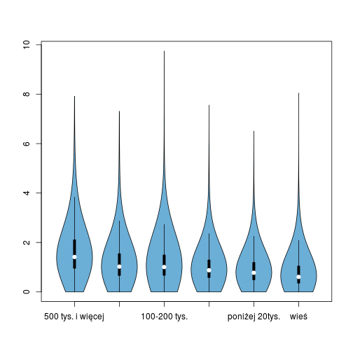 


Wiele wykresów na jednej stronie
--------------

W podstawowym **R** możemy tworzyć różne typy wykresów i prezentować je na jednej stronie. Służą do tego dwie funkcje:

* par i argument mfrow -- który określa liczbę możliwych wykresów na jednej stronie (o takich samych rozmiarach).
* layout -- która umożliwia tworzenie różnego układów wykresów (warto z niej korzystać przy tworzeniu tzw. dashboardów).


Porównamy ich działanie. Chcemy przedstawić 3 wykresy, które tworzyliśmy wcześniej na jednym wykresie.


```r
def.par <- par(no.readonly = TRUE)
par(mfrow=c(2,2)) ### możemy tworzyć układ 2x1, 2x1, 2x2 itd.
par(mar=c(2,2,2,2))

### wykres gęstości
plot(p2005,col='red',ylab='Gęstość',xlab='Dochód rozporządzalny',
     main='Porównanie dochodu rozporządzalnego 2005/2013')
lines(p2013,col='blue')
legend('topright',fill=c('red','blue'),legend=c('2005','2013'),bty='n')

### wykres kołowy 
pie(KLM)

### boxplot
boxplot(gosp$WAGA_GD_2013,
        main='Wykres pudełkowy wagi przypisanej gospodarstwu domowemu w 2013r.',
        sub='Źródło: Opracowanie własne na podstawie badania Diagnoza Społeczna',
        col='gray')

### reset ustawień
par(def.par)
```

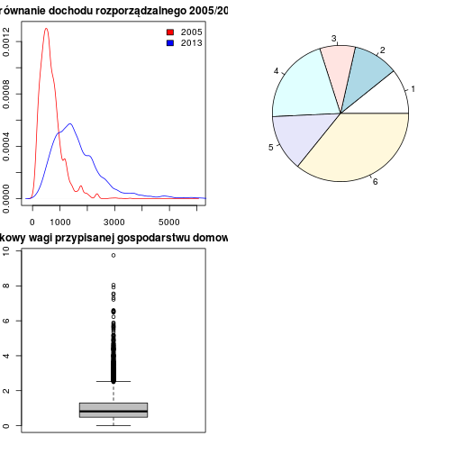 


Podobną rzecz mozemy wykonać z funkcją **layout** jednak jej opcje są o wiele większe i umożliwiają kontrolę nad układem wykresów.


```r
lo<-layout(matrix(c(1,1,2,3), 2, 2, byrow = TRUE))
par(mar=c(2,2,2,2))
### wykres gęstości
plot(p2005,col='red',ylab='Gęstość',xlab='Dochód rozporządzalny',
     main='Porównanie dochodu rozporządzalnego 2005/2013')
lines(p2013,col='blue')
legend('topright',fill=c('red','blue'),legend=c('2005','2013'),bty='n')

### wykres kołowy 
pie(KLM)

### boxplot
boxplot(gosp$WAGA_GD_2013,
        main='Wykres pudełkowy wagi przypisanej gospodarstwu domowemu w 2013r.',
        sub='Źródło: Opracowanie własne na podstawie badania Diagnoza Społeczna',
        col='gray')
```

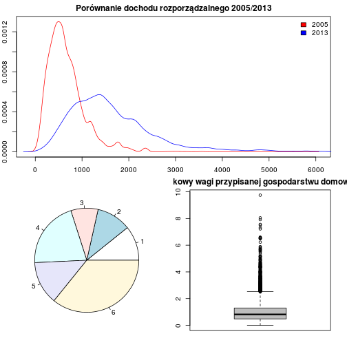 


Funkcją **layout.show** możemy podejrzeć jak wyglądać będzie tworzony wykres.


```r
par(def.par)
layout.show(lo)
```

   


