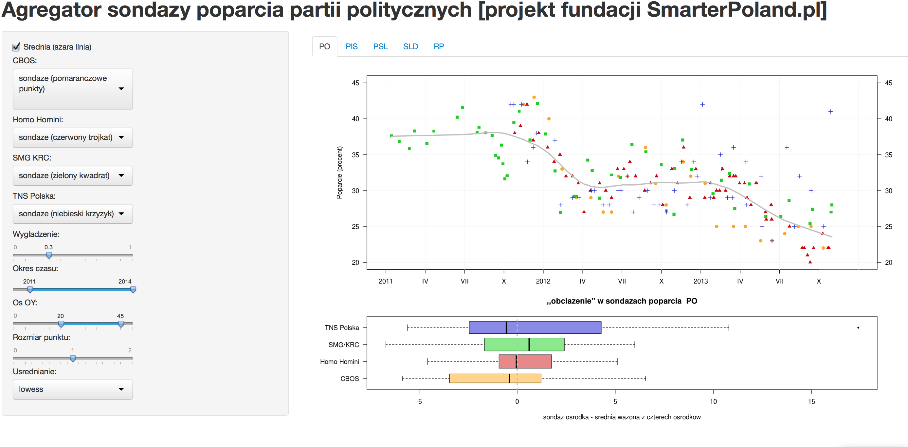

## Czym jest shiny?

* Shiny to pakiet, który umożliwia w prosty sposób tworzenie interaktywnych aplikacji (webowych) z poziomu R.

```{r example01,eval=FALSE}
library(shiny)
runExample("01_hello")
``` 

## Czym jest shiny?


## Czym jest shiny?


## Czym jest shiny?



## Budowa aplikacji

Aplikacja składa się z dwóch plików:

- server.R - zawierający funkcje, które mają zostać wykonane
- ui.R - zawierający wygląd aplikacji

...i tyle!

## Przykład pliku ui.R

```{r ui,eval=FALSE}
library(shiny)
# defuniujemy UI
shinyUI(
  fluidPage( ## określamy jak wygląda strona
  titlePanel("Hello Shiny!"), ## tytuł aplikacji
  sidebarLayout( ## dokładnie określamy układ okien
    sidebarPanel( ## definiujemy sidebar
      sliderInput("bins",
                  "Number of bins:",
                  min = 1,
                  max = 50,
                  value = 30)),
    # określamy co ma się znajdować w głównym panelu
    mainPanel(
      plotOutput("distPlot")
    )
  )
))
```

## Podstawowe funkcje w pliku ui.R

* `fluidPage` (jedna strona) oraz `navbarPage` (zakładki)
* `sidebarLayout`, `splitLayout`, `flowLayout`/`inputPanel`, `fluidRow` -- układy okien
* `sidebarPanel`, `mainPanel` -- określenie co znajduje się w `sidebarLayout`
* `actionButton`, `checkboxInput`, `checkboxGroupInput`, `dateInput`, `dateRangeInput`, `fileInput`, `numericInput`, `radioButtons`, `selectInput`, `sliderInput`, `submitButton` oraz `textInput` -- określamy co podajemy jako argumenty wejściowe do funkcji określonych w `server.r`


## Przykład pliku server.R

```{r server, eval=FALSE}
## ładujemy potrzebne pakiety i dane (będą wczytane tylko raz!)
library(shiny)
## definiujemy server jako funkcję input oraz output
shinyServer(
  function(input, output) {

  output$distPlot <-  ### przez out określamy co z funkcji wychodzi
    renderPlot({ 
    x    <- faithful[, 2]  # Old Faithful Geyser data
    bins <- seq(min(x), max(x), 
                length.out = input$bins + 1) ## przez input$ podajemy argumenty wejściowe

    # rysujemy histogram
    hist(x, breaks = bins, col = 'darkgray', border = 'white')
  })
})
```

## Podstawowe funkcje w pliku server.R

* `shinyServer` - rozpoczynamy od deklaracji serwera, którego pierwszy argument to funkcja mająca dwa argumenty `input` oraz `output`,
* `renderText`, `renderPrint` - wydruki tekstowe
* `renderTable`, `renderDataTable` - tabele
* `renderImage`, `renderPlot` - wykresy i rysunki


## Uruchamianie aplikacji

Tworzymy folder, którego nazwa ma odzwierciedlać nazwę aplikacji (np. WizMatur). Folder musi zawierać dwa pliki `ui.R` oraz `server.R`. Następnie aplikację uruchamiany lokalnie przez

```{r runapp,eval=FALSE}
library(shiny)
runApp("WizMatur")
```

Możemu również umieścić aplikację na serwerze Shiny lub `shinyapps.io`. Pozostałe funkcje do uruchomienia aplikacji

```{r runapp2,eval=FALSE}
runGist() ## z gist github
runGitHub() ## z github
runUrl() ## z URL
```

## Jak pracować z shiny?

Musimy sobie odpowiedzieć na następujące pytania:

1. Kto będzie odbiorcą aplikacji?
2. Co ma zawierać aplikacja? Wizualizacje czy raporty?
3. Jakie elementy mogę być zmieniane?
4. Jaki ma być układ aplikacji?
5. Jakie elementy mają być przekazywane z UI do serwera?

Zaczynamy od określenia pliku `server.R`, a dopiero później przechodzimy do budowy `ui.r`!

## Jak zacząć? Przykłady wbudowane

```{r examples_buildin,eval=FALSE}
system.file("examples", package="shiny")

runExample("01_hello") # a histogram
runExample("02_text") # tables and data frames
runExample("03_reactivity") # a reactive expression
runExample("04_mpg") # global variables
runExample("05_sliders") # slider bars
runExample("06_tabsets") # tabbed panels
runExample("07_widgets") # help text and submit buttons
runExample("08_html") # Shiny app built from HTML
runExample("09_upload") # file upload wizard
runExample("10_download") # file download wizard
runExample("11_timer") # an automated timer
```

## Jak zacząć? Pomoc

* [Shiny cheatsheet](http://shiny.rstudio.com/articles/cheatsheet.html)
* [Tutorial od RStudio](http://shiny.rstudio.com/tutorial/)
* [Shiny na Stackoverflow](http://stackoverflow.com/questions/tagged/r+shiny)
* [Budowanie aplikacji w Shiny](https://www.udemy.com/build-web-apps-in-r-with-shiny/)
* [Oficjalna pomoc do Shiny](http://shiny.rstudio.com/help/)
* [Przykłady aplikacji Shiny](http://www.showmeshiny.com)
* [Shiny w j.polskim - książka Przemka Biecka]()

## Przykłady własne

Przejdzmy do R

