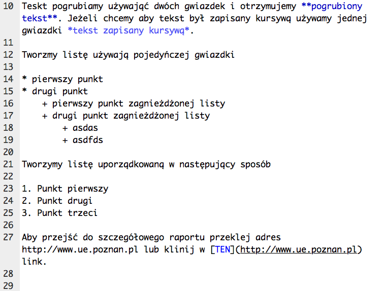

# Wstęp do R Markdown

Teskt pogrubiamy używająć dwóch gwiazdek i otrzymujemy **pogrubiony tekst**. Jeżeli chcemy aby tekst był zapisany kursywą używamy jednej gwiazdki *tekst zapisany kursywą*. 

Tworzmy listę używają pojedyńczej gwiazdki

* pierwszy punkt
* drugi punkt
    + pierwszy punkt zagnieżdżonej listy
    + drugi punkt zagnieżdżonej listy
        + asdas
        + asdfds
    
Tworzymy listę uporządkowaną w następujący sposób

1. Punkt pierwszy
2. Punkt drugi
3. Punkt trzeci

Aby przejść do szczegółowego raportu przeklej adres http://www.ue.poznan.pl lub klinij w [TEN](http://www.ue.poznan.pl) link.

Przykładowy zrzut ekranu umieszczony w dokumencie Markdown



# Wstawianie wzorów

Wzór $x^2 + y^2 = c^2$ jest ...

Niech $\alpha$ oznacza poziom istotności w teście...


Wzór na średnią ważoną dany jest następującym wzorem:

$$
\bar{x} = \frac{ \sum_{i=1}^{n} x_{i}w_{i} } { \sum_{i=1}^{n} w_{i} }
$$

# Wykresy

```{r rozklad_normalny,echo=FALSE,comment=''}
set.seed(123)
x <- rnorm(100)
x
```

```{r rozklad_normalny2,eval=FALSE}
set.seed(123)
x <- rnorm(100)
x
```

```{r wczytanie_biblioteki,message=FALSE, warning=FALSE, error=FALSE}
library(dplyr)
```

```{r histogram}
hist(x)
```

# Umieszanie kodu R w Markdown

Moja średnia wynosi `r mean(x)`, a odchylenie standardowe wynosi `r sd(x)`.

$$
V_x = \frac{ s_x }{ \bar{x}} \times 100\%  =
\frac{ `r sd(x)` }{ `r mean(x)` } \times 100\% = 
`r sd(x) / mean(x) * 100 ` \%.
$$


